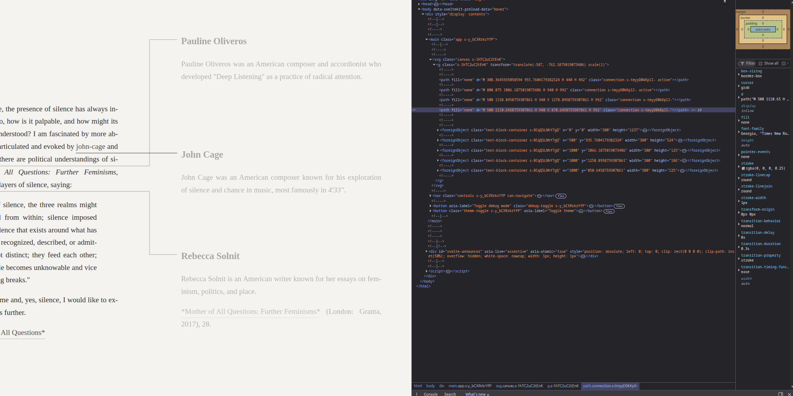

# Bug: Vertical line crossing horizontal line doesn't generate hop arc

## Summary
When a vertical connection line crosses a horizontal connection line, no hop arc is generated at the intersection point.

## Steps to Reproduce
1. Start with the Slow Reading corpus (fresh page load)
2. From "Slow Reading", click the "silences" link to open the Silence card
3. From "Silence", click "john-cage" to open the John Cage card
4. From "Silence", click "rebecca-solnit" to open the Rebecca Solnit card
5. From "Silence", click "pauline-oliveros" to open the Pauline Oliveros card

**Key observation**: John Cage and Rebecca Solnit will be created without enough vertical space remaining for Pauline Oliveros. This forces Pauline Oliveros to be placed above them, meaning its connection line must cross over one of the existing horizontal lines (e.g., the John Cage connection).

## Expected Behavior
A semicircular hop arc should appear where the Pauline Oliveros vertical line crosses over the John Cage horizontal line.

## Actual Behavior
The lines cross without any visual indication (no hop arc).

## Technical Notes

The `segmentsIntersect` function in `pathfinding.ts` has orthogonal segment detection but may have edge cases:

1. **Boundary condition issue**: The strict inequality check (`vx > minX && vx < maxX`) may fail when segments share a boundary coordinate

2. **T-junction vs crossing confusion**: The code correctly ignores T-junctions (where segments meet at endpoints), but may be incorrectly classifying some true crossings as T-junctions

3. **Coordinate precision**: Floating point comparisons with `< 1` tolerance may cause misclassification

## Potential Fix Areas

- `segmentsIntersect()` in `src/lib/utils/pathfinding.ts`
- `findCrossingsOnSegment()` in `src/lib/utils/pathfinding.ts`

## Files Involved
- `src/lib/utils/pathfinding.ts`
- `src/lib/components/Canvas.svelte`

## Priority
Medium - visual polish issue, doesn't affect functionality
