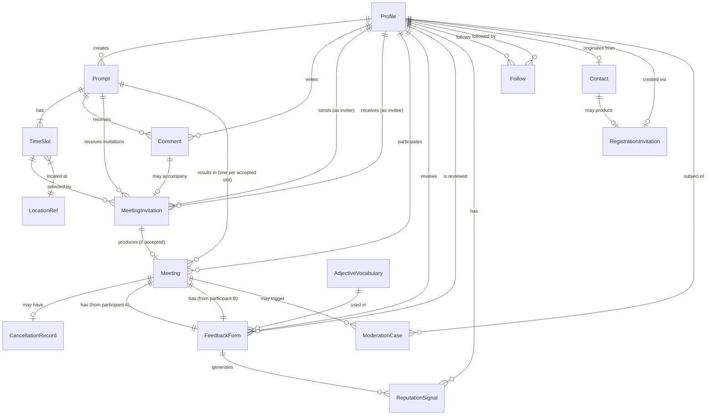

# Domain-Driven Design for Meeting Platform Flows

## Overview

Define the domain model, bounded contexts, aggregates, state machines, and interfaces needed to implement the four user stories (registration, prompt publishing, meeting invitations, feedback/reputation). This plan is language-agnostic, focusing on entities, components, and interfaces rather than specific code or frontend implementation.

## Problem Statement

The current codebase has no domain model layer. All database entities are accessed as raw Supabase query results with business logic scattered across route handlers. The `canvases` table is overloaded (serving as both editor workspace and "prompt"). There are no typed domain entities, no service layer, and no centralized state machines. Username enrichment is duplicated across 6+ endpoints.

The user stories describe a fundamentally different product direction — from a canvas editor to a social meeting platform. The domain model must support the full lifecycle: registration, prompt publishing with time slots, private invitations, in-person meetings, feedback with simultaneous reveal, and reputation.

## Bounded Contexts

The domain naturally divides into five bounded contexts. Each context owns its aggregates, enforces its invariants, and communicates with other contexts through domain events.

```
+------------------+     +--------------------+     +-------------------+
|   Registration   |     |     Content        |     |    Engagement     |
|                  |     |                    |     |                   |
| - Contact        |---->| - Prompt           |<--->| - Comment         |
| - Invitation     |     | - TimeSlot         |     | - MeetingInvite   |
| - Profile        |     | - Location         |     |                   |
| - Onboarding     |     | - CoverImage       |     |                   |
+------------------+     +--------------------+     +-------------------+
                                  |                         |
                                  v                         v
                         +--------------------+     +-------------------+
                         |     Meeting        |     |    Feedback &     |
                         |                    |     |    Reputation     |
                         | - Meeting          |<--->| - FeedbackForm    |
                         | - Cancellation     |     | - FeedbackGate    |
                         |                    |     | - ReputationSignal|
                         +--------------------+     +-------------------+
                                                           |
                                                    +------v----------+
                                                    |   Moderation    |
                                                    |                 |
                                                    | - ModerationCase|
                                                    | - CancelLog     |
                                                    +-----------------+
```

Cross-cutting concerns (not a bounded context):
- **Notification** — thin service that delivers events to users, following healthy-brain principle
- **Auth** — Supabase Auth for now; OIDC migration (Authentik/Keycloak) on roadmap for EU sovereignty and DID support. Avoid deepening Supabase Auth coupling; abstract behind auth interface where practical.
- **Location** — OpenStreetMap/Nominatim for autocomplete and geocoding (per shared infrastructure guide — no Google Maps). Protomaps or MapLibre for map rendering. Build as a separate module with clean API boundary for potential extraction.

---

## Aggregates & Entities

### 1. Registration Context

#### Profile (Aggregate Root)

| Field | Type | Notes |
|-------|------|-------|
| id | UUID | FK to auth.users |
| username | string | Chosen during onboarding. Supports pseudonymity. |
| state | enum | active / suspended / deleted |
| onboarded | boolean | Has completed onboarding flow |
| region | string | "berlin" for now; supports future regions |
| referred_by | Profile.id? | Referral chain |
| deleted_at | timestamp? | Soft-delete timestamp; triggers data retention period |
| created_at | timestamp | |

**Profile States:**
- `active` — normal user
- `suspended` — admin-suspended; cannot use the platform; requires moderator resolution
- `deleted` — soft-deleted; profile kept for data retention; reputation marks associated with email address

**Invariants:**
- Username must be unique
- Username should not be given too much importance (supports anonymity)
- Account deletion: auto-cancels meetings (same tier rules), releases other party from feedback gate, marks email for reputation persistence

#### Contact (Entity)

Pre-auth waitlist entry from the landing page join form.

| Field | Type | Notes |
|-------|------|-------|
| id | UUID | |
| email | string | |
| name | string | |
| freewrite | text | Application text |
| status | enum | pending / accepted / denied / hold |
| reviewed_at | timestamp? | When admin made decision |
| reviewed_by | Profile.id? | Which admin |

#### RegistrationInvitation (Entity)

| Field | Type | Notes |
|-------|------|-------|
| id | UUID | |
| email | string | |
| token | string | URL-safe token |
| expires_at | timestamp | Time-bound |
| used_at | timestamp? | When account was created (null = unused) |
| invited_by | Profile.id? | Admin who accepted |

**Invariants:**
- Token is time-bound but resilient (session drop mid-registration can resume with same link)
- One account per token (but not single-use in the strict sense)

#### Follow (Entity)

Lightweight way to stay connected within the platform.

| Field | Type | Notes |
|-------|------|-------|
| id | UUID | |
| follower_id | Profile.id | |
| following_id | Profile.id | |
| created_at | timestamp | |

**Invariants:**
- Unique pair (follower_id, following_id)
- No self-follows
- What following produces (feed, notifications on new prompts) is TBD

#### Notification (Entity)

| Field | Type | Notes |
|-------|------|-------|
| id | UUID | |
| user_id | Profile.id | Recipient |
| type | enum | meeting_invite / meeting_confirmed / meeting_cancelled / invitation_expired / feedback_due / feedback_revealed / comment_received / new_prompt (from followed) |
| data | JSON | Type-dependent payload (meeting id, prompt id, etc.) |
| read | boolean | |
| created_at | timestamp | |

**Invariants:**
- In-app by default; email/push are opt-in
- Healthy brain principle: minimal, never dark-pattern

---

### 2. Content Context

#### Prompt (Aggregate Root)

| Field | Type | Notes |
|-------|------|-------|
| id | string | nanoid |
| author_id | Profile.id | |
| title | string? | |
| body | JSON | Rich text (TipTap JSON). Basic formatting only. |
| cover_image_url | string? | Resized to standard size by system |
| state | enum | See state machine below |
| published_at | timestamp? | |
| archived_at | timestamp? | |
| created_at | timestamp | |

**Prompt State Machine:**

```
                          publish              re-publish
    draft ──────────────────────────> published <────────── archived
                                        |                      ^
                            +-----------+-----------+          |
                            |                       |          |
                     all slots expire     slot accepted         |
                      or booked          (slot hidden,          |
                            |           others remain)          |
                            v                  |                |
                        archived          meeting completed     |
                                          (Story 4)             |
                                               |                |
                                          feedback done         |
                                               |                |
                                               +────────────────+

    Note: A prompt is never fully "hidden" from discover.
    Individual time slots are hidden as they are booked.
    The prompt is archived only when NO valid future slots remain.
    Meeting cancellation (>=12h) releases the slot back to published.
    Sophie can voluntarily unpublish (active invitations resolved per cancellation policy).
```

**States:**
- `draft` — being written, not visible to anyone
- `published` — visible on discover page, map, and author's profile. Individual time slots are hidden as they are booked; prompt remains visible with remaining slots.
- `archived` — all slots expired/booked, or meeting cycle complete. Visible in author's private profile. Can be re-published with new time slots.
- Note: when a meeting is cancelled (>=12h), the slot becomes available again and the prompt remains/returns to published state. The prompt is never fully "hidden" — only individual slots are consumed.

**Invariants:**
- Maximum active prompts per user (exact limit TBD)
- Content moderation on cover image (approach TBD)
- No contact details in body text (enforcement TBD)

#### TimeSlot (Value Object, owned by Prompt)

| Field | Type | Notes |
|-------|------|-------|
| id | UUID | Needed for invitation references |
| start_time | timestamp | Within 7 days of creation/edit |
| duration_minutes | integer | Suggested duration |
| exact_location | LocationRef | Stored but not publicly shown |
| general_area | string | System-derived from exact location (Airbnb-style) |
| has_pending_invitation | boolean | Derived; prevents editing/removal |

**Invariants:**
- 1-3 slots per prompt
- All slots must be within a rolling 7-day window from today
- Slots without pending invitations can be edited/removed
- Slots with pending invitations are locked
- Location selected via autocomplete, region-scoped

#### LocationRef (Value Object)

| Field | Type | Notes |
|-------|------|-------|
| place_id | string | From location API |
| name | string | Venue/place name |
| address | string | Full address |
| coordinates | {lat, lng} | For map display and area derivation |
| general_area | string | Neighbourhood/postcode, system-generated |
| region | string | "berlin" — validated against app instance region |

---

### 3. Engagement Context

#### Comment (Entity)

Private single-shot message from any user to the starter. Can exist without an invitation.

| Field | Type | Notes |
|-------|------|-------|
| id | UUID | |
| prompt_id | Prompt.id | |
| author_id | Profile.id | |
| body | text | Enforce: no contact details |
| edited | boolean | Shows "edited" indicator if modified after creation |
| created_at | timestamp | |
| updated_at | timestamp? | |

**Invariants:**
- One comment per user per prompt
- Private: only visible to author and starter
- Commenters cannot see each other's comments
- Starter can see all comments
- Can be submitted without an invitation (comment-only engagement)
- Editable (with "edited" indicator)
- Track comment-without-invite metric (no limit, but monitored)

#### MeetingInvitation (Aggregate Root)

| Field | Type | Notes |
|-------|------|-------|
| id | UUID | |
| prompt_id | Prompt.id | |
| comment_id | Comment.id? | The comment that may accompany this invitation (optional — comment may exist independently) |
| inviter_id | Profile.id | |
| invitee_id | Profile.id | Prompt author |
| selected_slot_id | TimeSlot.id | ONE slot selected |
| message | text | Personal message to starter |
| state | enum | See state machine below |
| created_at | timestamp | |
| resolved_at | timestamp? | When accepted/expired/cancelled |

**MeetingInvitation State Machine:**

```
                  inviter cancels
    pending ─────────────────────────> cancelled
       |
       +────── slot time passes ────> expired
       |        (or 12h cutoff)
       |
       +──── invitee accepts ───────> accepted ──> creates Meeting
       |
       +──── prompt archived ────────> expired
```

**States:**
- `pending` — awaiting response; inviter can withdraw (free action, no consequences)
- `accepted` — invitee confirmed; triggers Meeting creation; accepted slot hidden from others
- `cancelled` — inviter withdrew (free action)
- `expired` — 12h before slot start time reached without response, or prompt archived/unpublished

**Invariants:**
- One pending invitation per inviter per prompt
- Multiple users can have pending invitations on the same prompt (even the same slot)
- Inviter selects exactly ONE time+place option
- No negotiation — accept as-is or don't
- Sophie can accept invitations for multiple time slots (one per slot); each accepted slot is hidden from other users
- Invitations expire 12 hours before the selected slot's start time
- Race condition on near-simultaneous acceptances must be handled (only one acceptance per slot)
- Time slots where the inviter already has a meeting are hidden (cannot select them)

---

### 4. Meeting Context

#### Meeting (Aggregate Root)

| Field | Type | Notes |
|-------|------|-------|
| id | UUID | |
| prompt_id | Prompt.id | |
| invitation_id | MeetingInvitation.id | Source invitation |
| participant_a | Profile.id | Starter |
| participant_b | Profile.id | Inviter |
| scheduled_time | timestamp | From the accepted time slot |
| duration_minutes | integer | From the time slot |
| exact_location | LocationRef | Now revealed to both parties |
| state | enum | See state machine below |
| created_at | timestamp | |

**Meeting State Machine:**

```
                     cancel >=12h
    scheduled ──────────────────────> cancelled_early
       |                                   |
       |                             (explanation logged,
       |                              prompt reappears)
       |
       +───── cancel <12h ──────────> cancelled_late
       |                                   |
       |                             (reputation mark,
       |                              maybe 1 free pass)
       |
       +───── start time passes ────> awaiting_feedback
                                           |
                                     (feedback gate activates
                                      for both participants)
                                           |
                                     both feedbacks submitted
                                           |
                                           v
                                       completed
                                           |
                                     (prompt archived,
                                      reputation signals created)
```

**States:**
- `scheduled` — confirmed meeting, visible to both parties with exact location
- `cancelled_early` — cancelled >=12h before; explanation required and logged for moderation
- `cancelled_late` — cancelled <12h before; reputation consequences
- `awaiting_feedback` — meeting start time has passed; both parties must submit feedback
- `completed` — both feedbacks submitted and revealed; terminal state; triggers prompt archival

**Invariants:**
- Either party can cancel — cancellation is symmetric (same tiers apply to both)
- Cancellation >=12h: free-text explanation required, logged for moderation patterns
- Cancellation <12h or no-show: maybe 1 free pass, then reputation mark
- When cancelled_early: accepted time slot is released back to the prompt
- Account deletion: auto-generated cancellation message, same tier rules apply; releases other party from feedback gate; reputation mark associated with email address; profile soft-deleted with data retention period
- A user cannot have multiple meetings at the same time (conflicting slots are hidden)

#### CancellationRecord (Value Object, owned by Meeting)

| Field | Type | Notes |
|-------|------|-------|
| cancelled_by | Profile.id | Who cancelled |
| cancelled_at | timestamp | |
| reason | text | Free-text explanation (required for >=12h) |
| tier | enum | early (>=12h) / late (<12h) |
| free_pass_used | boolean | Whether this consumed the 1 free pass |

---

### 5. Feedback & Reputation Context

#### FeedbackForm (Entity)

| Field | Type | Notes |
|-------|------|-------|
| id | UUID | |
| meeting_id | Meeting.id | |
| reviewer_id | Profile.id | Who is giving feedback |
| reviewee_id | Profile.id | Who feedback is about |
| did_meet | boolean | Did the meeting take place? |
| no_show_reason | text? | If did_meet=false |
| rating_tags | string[] | Selected from admin-curated adjective vocabulary |
| free_text | text? | |
| share_with_person | text? | What to share with the other party |
| share_with_platform | text? | What to share with admins |
| platform_comments | text? | Any comments for the platform |
| state | enum | See state machine below |
| submitted_at | timestamp? | |
| locked_at | timestamp? | When both parties submitted |

**FeedbackForm State Machine:**

```
    not_due ───── meeting start time passes ──> due (gated)
                                                    |
                                     +--------------+--------------+
                                     |                             |
                                user submits              other party deletes
                                     |                    account / moderator
                                     v                    ungates
                               submitted (editable)            |
                                     |                         v
                           other party also submits         released
                                     |
                                     v
                               locked (revealed)
```

**States:**
- `not_due` — meeting hasn't started yet
- `due` — meeting start time has passed; user is gated (immediately, even mid-session)
- `submitted` — user has submitted but can still edit (other party hasn't submitted yet)
- `locked` — both parties submitted; feedback revealed simultaneously; no more edits
- `released` — other party deleted account or moderator intervened; gate cleared without mutual reveal

**Invariants:**
- Editable after submission until both parties have submitted
- Simultaneous reveal: neither party sees the other's feedback until both are locked
- Only "share with person" portion is shown to the other party
- "Share with platform" portion is routed to admin/moderation

#### FeedbackGate (Value Object, derived from FeedbackForm state)

Not a persisted entity — derived from the user's outstanding FeedbackForms.

**Rules:**
- If any FeedbackForm for this user is in `due` state → gate is active
- Gate blocks: entire app. No access at all until minimum feedback is given. Hard line.
- Gate activates immediately when meeting start time passes (even mid-session, not just on login)
- A user cannot have multiple concurrent meetings, so stacked gates are not possible
- No push notifications for the gate — the blocking IS the reminder
- Account deletion by the other party releases the gate
- Multi-step gating to reduce friction while ensuring thoughtful feedback is TBD for later

#### ReputationSignal (Entity)

Visible on profile when others evaluate whether to invite/accept.

| Field | Type | Notes |
|-------|------|-------|
| id | UUID | |
| profile_id | Profile.id | |
| signal_type | enum | feedback_received / cancellation / no_show |
| source_meeting_id | Meeting.id | |
| visible | boolean | Whether this signal is shown on profile |
| content | JSON | Type-dependent (feedback text, cancellation count, etc.) |
| created_at | timestamp | |

**Rules:**
- Feedback received: user controls whether to display it on profile
- Cancellation/no-show: maybe 1 free pass before signal becomes visible; user cannot hide these
- Repeated cancels/no-shows trigger moderation
- Not a score — expressed through visible signals, not a number

#### AdjectiveVocabulary (Reference Data)

| Field | Type | Notes |
|-------|------|-------|
| id | UUID | |
| word | string | |
| active | boolean | Can be retired over time |
| created_by | Profile.id | Admin who added it |

Curated by admins as a starting set, evolved over time.

---

### 6. Moderation Context

#### ModerationCase (Entity)

| Field | Type | Notes |
|-------|------|-------|
| id | UUID | |
| type | enum | no_show / repeated_cancellation / report / feedback_deadlock |
| subject_id | Profile.id | User being reviewed |
| meeting_id | Meeting.id? | Related meeting if applicable |
| status | enum | open / investigating / resolved |
| resolution | text? | |
| created_at | timestamp | |
| resolved_at | timestamp? | |
| resolved_by | Profile.id? | Admin who resolved |

**Triggers:**
- No-show reported in feedback → auto-create case
- Both parties report no-show → auto-create case (disputed outcome)
- Repeated cancellations/no-shows exceed threshold → auto-create case
- User never submits feedback and other party requests moderator → create case
- Moderator can ungate a user if there is a compelling reason
- Account deletion with active meetings → auto-cancel with same tier rules; mark associated with email

#### CancellationLog (Value Object)

Accumulated from CancellationRecords. Used for moderation pattern detection.

| Field | Type | Notes |
|-------|------|-------|
| profile_id | Profile.id | |
| total_cancellations | integer | |
| late_cancellations | integer | |
| no_shows | integer | |
| free_passes_used | integer | |
| last_incident_at | timestamp | |

---

## Domain Events

Events flow between bounded contexts. Each event is a fact that has occurred — consumers react asynchronously.

| Event | Emitted By | Consumed By |
|-------|-----------|------------|
| `ContactSubmitted` | Registration | Notification (admin) |
| `ContactDecisionMade` | Registration | Notification (visitor email) |
| `UserRegistered` | Registration | Content (unlocks discover) |
| `PromptPublished` | Content | Notification (followers?), discover index |
| `PromptArchived` | Content | Engagement (expire pending invitations) |
| `CommentCreated` | Engagement | Notification (starter) |
| `CommentEdited` | Engagement | — |
| `AccountDeleted` | Registration | Meeting (auto-cancel), Feedback (release gate), Reputation (mark email) |
| `InvitationCreated` | Engagement | Notification (invitee), Content (lock slot) |
| `InvitationAccepted` | Engagement | Meeting (create), Content (hide slot), Engagement (start expiry timer for others) |
| `InvitationCancelled` | Engagement | Content (unlock slot) |
| `InvitationExpired` | Engagement | Content (unlock slot), Notification (inviter) |
| `MeetingScheduled` | Meeting | Notification (both), Content (hide accepted slot from discover) |
| `MeetingCancelledEarly` | Meeting | Content (prompt reappears), Moderation (log), Notification (other party) |
| `MeetingCancelledLate` | Meeting | Reputation (mark), Moderation (log), Notification (other party) |
| `MeetingStartTimePassed` | Meeting (timer) | Feedback (create forms, activate gate) |
| `FeedbackSubmitted` | Feedback | — (held until both submit) |
| `FeedbackRevealed` | Feedback | Notification (both), Reputation (create signals) |
| `FeedbackGateActivated` | Feedback | Auth/UI (enforce gate) |
| `FeedbackGateCleared` | Feedback | Auth/UI (remove gate) |
| `ModerationCaseCreated` | Moderation | Notification (admin) |
| `UserUngated` | Moderation | Feedback (override gate) |
| `PromptCreated` | Content | — (draft, not visible) |
| `PromptUnpublished` | Content | Engagement (resolve invitations per cancellation policy) |
| `PromptRepublished` | Content | Notification (followers), discover index |
| `SlotExpired` | Content (timer) | Engagement (expire pending invitations on this slot), Content (archive if no valid slots remain) |
| `MeetingCompleted` | Meeting | Content (archive prompt), Reputation (create signals) |
| `ProfileDeleted` | Registration | Meeting (auto-cancel), Feedback (release gate), Reputation (mark email) |
| `ProfileSuspended` | Moderation | Auth (revoke session) |

---

## Interfaces Between Contexts

### Registration (Story 1)

```
interface RegistrationService {
  submitContact(form): Contact
  reviewContact(contactId, decision, adminId): void  // accept / deny / hold
  generateInvitation(contactId): RegistrationInvitation
  createAccount(token, username): Profile
  completeOnboarding(profileId): void
}
```

### Content — Queries (Stories 2, 3)

```
interface PromptQueryService {
  getPublishedPrompts(region: Region, userId: ProfileId, filters?): PromptSummary[]
  // userId needed to filter out time slots where this user already has a meeting
  getPromptDetail(id, userId): PromptDetail
  // includes general areas, NOT exact locations; hides slots user can't use
  getAvailableSlots(promptId, userId): TimeSlot[]
  // excludes: accepted slots, slots conflicting with user's existing meetings
  getProfilePrompts(profileId): PromptSummary[]
  // for profile view — includes archived prompts for private profile
}
```

### Content — Commands (Story 3)

```
interface PromptCommandService {
  create(authorId, content, coverImage?): Prompt                 // creates draft
  publish(promptId, timeSlots: TimeSlotInput[]): void            // draft -> published
  editSlots(promptId, updates: SlotUpdate[]): void               // only unlocked slots
  unpublish(promptId): void                                      // resolves invitations per cancellation policy
  republish(promptId, newSlots: TimeSlotInput[]): void           // archived -> published
  acceptSlot(slotId): void                                       // hides slot from other users
  releaseSlot(slotId): void                                      // releases slot (cancellation/expiry)
  archive(promptId): void                                        // auto-archive when no valid future slots
}
```

### Engagement (Story 2)

```
interface CommentService {
  create(promptId, authorId, body): Comment
  edit(commentId, body): Comment     // sets edited=true
}
```

### Content <-> Engagement

### Engagement <-> Meeting

```
interface MeetingFactory {
  createFromInvitation(invitation: MeetingInvitation): Meeting
  // Reveals exact location to both parties
  // Sets prompt to scheduled state
  // Starts expiry timer for other pending invitations
}
```

### Meeting <-> Feedback

```
interface FeedbackLifecycle {
  createFeedbackForms(meeting: Meeting): [FeedbackForm, FeedbackForm]
  // Creates one form per participant
  // Activates feedback gate for both
  activateGate(userId: ProfileId): void
  clearGate(userId: ProfileId): void
  checkGate(userId: ProfileId): GateStatus
  // GateStatus: { active: boolean, pendingFeedbackIds: string[] }
}
```

### Feedback <-> Reputation

```
interface ReputationService {
  recordFeedback(feedback: FeedbackForm, meeting: Meeting): void
  recordCancellation(cancellation: CancellationRecord): void
  getProfileSignals(profileId): ReputationSignal[]
  // Used when evaluating whether to invite/accept
  setFeedbackVisibility(signalId, visible: boolean): void
  // User controls which received feedback to display
}
```

### Cross-cutting: Notification

```
interface NotificationService {
  notify(userId: ProfileId, event: DomainEvent): void
  // Follows healthy-brain principle:
  // - In-app only by default
  // - Opt-in for email/push
  // - Minimal information pushed
  getUnread(userId: ProfileId): Notification[]
}
```

### Profile

```
interface ProfileQueryService {
  getPublicProfile(profileId): PublicProfile
  // prompts created/joined, reputation signals, chosen-to-display feedback
  getPrivateProfile(userId): PrivateProfile
  // includes archived prompts, meeting history, all feedback
  setFeedbackVisibility(signalId, visible: boolean): void
}
```

### Data Export (GDPR)

```
interface DataExportService {
  exportUserData(userId): UserDataExport
  // JSON export: profile, prompts, meeting history, feedback given/received,
  // reputation signals, comments, notification history
  // Build as separate module with clean API boundary
}
```

### Cross-cutting: FeedbackGate Middleware

```
interface GateEnforcement {
  // Applied at the routing/middleware level
  // Hard line: blocks ALL app access until minimum feedback is given
  checkGate(userId: ProfileId): { gated: boolean, feedbackFormId?: string }
  // If gated, redirect to feedback submission — nothing else accessible
  // Activates immediately when meeting start time passes (even mid-session)
}
```

---

## Entity Relationship Diagram



---

## Resolved Gaps (from SpecFlow Analysis + Co-Founder Sync)

All critical gaps from the SpecFlow analysis have been resolved:

1. **Cancellation is symmetric.** Both parties can cancel with the same tiers. ✅
2. **Comments allowed without invitation.** One per prompt, editable. Not a contradiction — it's a one-way response, not a messaging channel. ✅
3. **12h cutoff = 12h before slot start time.** Invitations expire if not responded to by then. ✅
4. **Account deletion:** Auto-cancellation (same tier rules), releases feedback gate, reputation mark on email, soft-delete with retention. ✅
5. **Invitation terminal states:** `expired` (12h cutoff reached or prompt archived). Inviter notified (wording TBD). ✅
6. **Feedback gate activates immediately** when meeting start time passes, even mid-session. ✅
7. **No concurrent meetings.** Conflicting time slots are hidden. Stacked gates impossible. ✅
8. **Sophie can unpublish.** Active invitations resolved per cancellation policy. ✅
9. **Slot expiry:** Invitations expire 12h before slot start time. ✅
10. **Empty profiles:** No action needed. Fine as-is. ✅
11. **Feedback display:** Users can change visibility at any time. ✅
12. **Prompt after meeting:** Archived. Visible in private profiles. Re-publishable. ✅

## Remaining Follow-Ups

- **Slot-blocking concern:** A user could accept invitations across many prompts to block slots, then cancel before the 12h window. Starters should be deliberate about accepting. A response window may help. Revisit based on usage.
- **Invitation expiry notification wording:** Must avoid "rejection" framing. TBD.
- **Multi-step feedback gating:** Hard line for now. Later: tune to reduce friction while ensuring thoughtful, authentic feedback.
- **Cover image moderation approach:** TBD.
- **Regional verification:** TBD.
- **Calendar event format:** TBD.

---

## Implementation Phases

### Phase 0: Extraction & Infrastructure

Separate the canvas component and establish infrastructure foundations.

- **Extract canvas as separate open-source component** (canvasStore, Canvas.svelte, SiteSPA, d3-zoom, pathfinding). Dyad may consume it as a dependency but it leaves the Dyad codebase.
- Location service: set up Nominatim/OSM integration as a separate module with clean API boundary
- Notification service: build as extractable module (healthy-brain defaults)
- Calendar service: .ics generation as extractable module (no Google/Outlook API dependency)

### Phase 1: Foundation

Define the core entities, state machines, and database schema.

- Profile aggregate (extend existing; add state: active/suspended/deleted)
- Prompt aggregate (separate from canvas — the `canvases` table needs splitting)
- TimeSlot and LocationRef value objects
- Follow entity
- Notification entity
- State machine definitions for Prompt, MeetingInvitation, Meeting, FeedbackForm
- Database migrations for new/altered tables
- Domain event definitions
- Auth interface abstraction (prepare for eventual OIDC migration without doing it now)

### Phase 2: Content & Engagement

Prompt publishing, discover feed, commenting, invitations.

- Prompt CRUD with state transitions (draft → published → archived)
- TimeSlot management (create, edit, remove with invitation-lock guard; rolling 7-day window)
- Location API integration (Nominatim) and general area derivation
- Comment creation (private, single-shot, one per user per prompt, editable)
- MeetingInvitation creation, withdrawal, and expiry (12h before slot)
- Discover page query service (with per-user slot filtering)
- Map view integration (MapLibre/Protomaps)
- Follow profiles
- Unpublish and re-publish flows

### Phase 3: Meeting & Feedback

Meeting confirmation, cancellation tiers, feedback gate, simultaneous reveal.

- Meeting creation from accepted invitation (per-slot acceptance)
- Cancellation flow with symmetric tiers
- Feedback gate middleware (hard line, immediate activation)
- Feedback form submission, editing, and release transitions
- Simultaneous reveal logic
- Reputation signal creation
- Calendar event generation (.ics)
- Data export service (GDPR)

### Phase 4: Moderation & Reputation

Admin tools, moderation cases, reputation visibility.

- No-show detection and case creation (including both-report-no-show)
- Cancellation pattern detection
- Admin moderation interface (full visibility: prompts, invitations, feedback, profiles)
- Admin actions: suspend users, force-cancel meetings, edit/remove prompts
- Reputation signals on profile
- Adjective vocabulary management
- Account deletion cascade handling (soft-delete, auto-cancel, release gates, email reputation marks)

### Roadmap (not phased yet)

- **OIDC migration**: Scope and execute migration from Supabase Auth to self-hosted OIDC provider (Authentik/Keycloak). Required for EU sovereignty and future DID support.
- **DID/VC readiness**: Add external identifier support to Profile, explore Verifiable Credentials for portable reputation.
- **Multi-step feedback gating**: Tune the hard-line gate to reduce friction while ensuring thoughtful feedback.
- **Regional verification**: Solve the Berlin-presence verification problem.

---

## Sources & References

### Origin

- **User stories:** `docs/stories/001-004` — Four stories covering the complete user journey
- **Design principles:** `docs/design/design-principles.md` — Cross-cutting decisions (no pre-meeting contact, healthy brain, reputation, regional presence)
- **BPMN diagrams:** `docs/stories/001-004.bpmn` — Process models for each story

### Existing Codebase

- Current types: `src/lib/types/index.ts` (lines 1-103) — canvas-focused, needs domain model layer
- Meetings API: `src/routes/api/meetings/+server.ts` (lines 72-93) — comment gate logic, inline
- Meeting feedback API: `src/routes/api/meeting-feedback/+server.ts` (lines 1-63)
- Invitation system: `supabase/migrations/20260214_create_invitations.sql`
- Meeting invitations: `supabase/migrations/20260217_create_meeting_invitations.sql`
- Notifications: `supabase/migrations/20260216_create_notifications.sql`
- Profiles: `supabase/migrations/20260214_profiles_add_berlin.sql`

### Architectural Patterns to Preserve

- Singleton store with `$state` runes (`src/lib/stores/canvas.svelte.ts`)
- Generation counters for async race protection
- Copy-on-write for Map/Set reactivity
- Supabase RLS for authorization
- SvelteKit form actions for mutations
