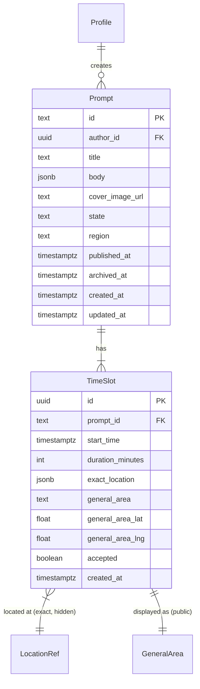

# Prompt Schema, CRUD & Discover Feed

First shippable milestone: "a prompt can be created and discovered."

## Overview

Create the `prompts` and `time_slots` tables, build a typed service layer, implement prompt CRUD endpoints, integrate Nominatim for location, and rewrite the discover feed to query the new schema. The canvas component and existing canvases table are untouched.

## Problem Statement

The current codebase has no proper domain model for prompts. Conversations are overloaded onto the `canvases` table with serialized JSON for time slots and locations. The discover page parses multiple legacy formats. Business logic is inline in route handlers with no service layer. There are no typed entities, no state machines, and significant duplication across endpoints.

## Proposed Solution

Build the new domain model alongside the existing code. New tables (`prompts`, `time_slots`), a typed service layer (`src/lib/services/`), domain types (`src/lib/domain/`), and rewritten discover/API endpoints that use the new schema.

(see brainstorm: `docs/brainstorms/2026-03-24-backend-implementation-sequence-brainstorm.md` — Key Decisions 1-5)

## Technical Approach

### Architecture

```
src/lib/
  domain/
    types.ts          — Prompt, TimeSlot, LocationRef, enums
    prompt.ts          — Prompt state machine, guard functions
    time-slot.ts       — TimeSlot state derivation
  services/
    prompt-query.ts    — PromptQueryService (interface + implementation)
    prompt-command.ts  — PromptCommandService (interface + implementation)
    location.ts        — Nominatim integration, general area derivation
  server/
    username-lookup.ts — buildUsernameMap (extracted from 7+ call sites)
    parse-body.ts      — parseJsonBody (extracted from 11 call sites)
    auth.ts            — requireAuth, requireAdmin (extracted)

src/routes/
  api/prompts/
    +server.ts                    — GET (list), POST (create)
    [id]/+server.ts               — GET (detail), PATCH (update content)
    [id]/publish/+server.ts       — POST (publish with slots)
    [id]/slots/+server.ts         — PATCH (add/edit/remove unlocked slots)
    [id]/unpublish/+server.ts     — POST (unpublish → archived)
    [id]/republish/+server.ts     — POST (republish with new slots)

  discover/
    +page.server.ts               — Rewritten to use PromptQueryService
```

### Database Schema

#### `prompts` table

```sql
-- supabase/migrations/YYYYMMDD_create_prompts.sql

CREATE TABLE prompts (
  id TEXT PRIMARY KEY DEFAULT nanoid(),  -- nanoid() function must exist; check existing migrations or create via pgcrypto extension
  author_id UUID NOT NULL REFERENCES auth.users(id) ON DELETE CASCADE,
  title TEXT,
  body JSONB,                          -- TipTap JSON
  cover_image_url TEXT,
  state TEXT NOT NULL DEFAULT 'draft'
    CHECK (state IN ('draft', 'published', 'archived')),
  region TEXT NOT NULL DEFAULT 'berlin',
  published_at TIMESTAMPTZ,
  archived_at TIMESTAMPTZ,
  created_at TIMESTAMPTZ NOT NULL DEFAULT now(),
  updated_at TIMESTAMPTZ NOT NULL DEFAULT now()
);

-- Indexes
CREATE INDEX idx_prompts_author ON prompts(author_id);
CREATE INDEX idx_prompts_discover ON prompts(state, region)
  WHERE state = 'published';

-- Auto-update updated_at
CREATE OR REPLACE FUNCTION update_updated_at()
RETURNS TRIGGER AS $$
BEGIN
  NEW.updated_at = now();
  RETURN NEW;
END;
$$ LANGUAGE plpgsql;

CREATE TRIGGER prompts_updated_at
  BEFORE UPDATE ON prompts
  FOR EACH ROW EXECUTE FUNCTION update_updated_at();
```

#### `time_slots` table

```sql
-- In same migration or separate

CREATE TABLE time_slots (
  id UUID PRIMARY KEY DEFAULT gen_random_uuid(),
  prompt_id TEXT NOT NULL REFERENCES prompts(id) ON DELETE CASCADE,
  start_time TIMESTAMPTZ NOT NULL,
  duration_minutes INTEGER NOT NULL DEFAULT 60,
  exact_location JSONB NOT NULL,       -- {place_id, name, address, lat, lng}
  general_area TEXT NOT NULL,           -- "Kreuzberg" or "10999" — derived from exact_location
  general_area_lat DOUBLE PRECISION,   -- Neighbourhood centroid for map pins
  general_area_lng DOUBLE PRECISION,   -- (NOT the exact location)
  accepted BOOLEAN NOT NULL DEFAULT false,
  created_at TIMESTAMPTZ NOT NULL DEFAULT now()
);

-- Indexes
CREATE INDEX idx_time_slots_prompt ON time_slots(prompt_id);
CREATE INDEX idx_time_slots_discover ON time_slots(prompt_id, start_time)
  WHERE accepted = false;

-- Constraint: max 3 non-accepted slots per prompt
-- (Enforced in service layer, not DB — the "3 slot" limit applies to
-- available+accepted combined, which is easier to check in code)
```

**Time slot state is derived, not stored.** A slot's effective state is:

| Condition | Effective State | Editable? | Visible on Discover? |
|-----------|----------------|-----------|---------------------|
| `accepted = false` AND `start_time - 12h > now()` | available | Yes (if no pending invitations — checked via meeting_invitations query) | Yes |
| `accepted = false` AND `start_time - 12h <= now()` | closing | No | No (within 12h cutoff) |
| `accepted = false` AND `start_time <= now()` | expired | No | No |
| `accepted = true` | booked | No | No |

This avoids a state column that must be kept in sync. The service layer derives state from `accepted` + `start_time` + invitation queries.

#### LocationRef structure (stored in `exact_location` JSONB)

```typescript
interface LocationRef {
  place_id: string;     // Nominatim place_id
  name: string;         // Venue/place name
  address: string;      // Full address string
  lat: number;          // Exact latitude
  lng: number;          // Exact longitude
}
```

`general_area` (text) and `general_area_lat`/`general_area_lng` (coordinates) are stored as top-level columns, derived from `exact_location` at write time. The general area string comes from Nominatim reverse geocoding (neighbourhood or suburb level). The general area coordinates are the neighbourhood centroid — NOT the exact location — used for map pins.

**Exact location is hidden at the application layer.** The service layer never returns `exact_location` in discover/detail queries. It is only exposed when a meeting is confirmed (Story 2, Step 5 of the brainstorm).

#### RLS Policies

```sql
-- prompts: author can CRUD, authenticated users can read published
ALTER TABLE prompts ENABLE ROW LEVEL SECURITY;

CREATE POLICY "Authors can manage own prompts"
  ON prompts FOR ALL
  USING (auth.uid() = author_id);

CREATE POLICY "Authenticated users can read published prompts"
  ON prompts FOR SELECT
  USING (state = 'published' AND auth.role() = 'authenticated');

-- time_slots: follow prompt ownership for writes, readable if prompt is published
ALTER TABLE time_slots ENABLE ROW LEVEL SECURITY;

CREATE POLICY "Authors can manage own time slots"
  ON time_slots FOR ALL
  USING (
    EXISTS (
      SELECT 1 FROM prompts
      WHERE prompts.id = time_slots.prompt_id
      AND prompts.author_id = auth.uid()
    )
  );

CREATE POLICY "Authenticated users can read slots of published prompts"
  ON time_slots FOR SELECT
  USING (
    EXISTS (
      SELECT 1 FROM prompts
      WHERE prompts.id = time_slots.prompt_id
      AND prompts.state = 'published'
    )
    AND auth.role() = 'authenticated'
  );
```

Note: RLS returns all columns including `exact_location`. The service layer strips this field before returning to clients. This is defense-in-depth at the application level, not the database level.

### Prompt State Machine

```
                      publish              republish
  draft ──────────────────────> published <────────── archived
                                   |                     ^
                        +----------+----------+          |
                        |                     |          |
                  all slots expire      unpublish        |
                   or all accepted                       |
                        |                     |          |
                        v                     +──────────+
                     archived
```

**Transitions:**
- `draft → published`: Requires 1-3 time slots with locations. Sets `published_at`.
- `published → archived`: Auto (all slots expired or accepted) or manual (unpublish). Sets `archived_at`. On unpublish, pending invitations are expired (Story 2/4 handles this later — for Steps 1-3, there are no invitations yet).
- `archived → published`: Republish with new time slots. Updates `published_at`. Appears as new on discover.

**Guard functions (in `src/lib/domain/prompt.ts`):**

```typescript
function canPublish(prompt: Prompt, slots: TimeSlotInput[]): boolean {
  return prompt.state === 'draft'
    && slots.length >= 1
    && slots.length <= 3
    && slots.every(s => isWithinRollingWindow(s.start_time));
}

function canUnpublish(prompt: Prompt): boolean {
  return prompt.state === 'published';
}

function canRepublish(prompt: Prompt, slots: TimeSlotInput[]): boolean {
  return prompt.state === 'archived'
    && slots.length >= 1
    && slots.length <= 3
    && slots.every(s => isWithinRollingWindow(s.start_time));
}

function isWithinRollingWindow(startTime: Date): boolean {
  const now = new Date();
  const sevenDaysFromNow = new Date(now.getTime() + 7 * 24 * 60 * 60 * 1000);
  return startTime > now && startTime <= sevenDaysFromNow;
}
```

### Service Interfaces

#### `src/lib/domain/types.ts`

```typescript
// Prompt states
export type PromptState = 'draft' | 'published' | 'archived';

// Core entities
export interface Prompt {
  id: string;
  author_id: string;
  title: string | null;
  body: JSONContent | null;
  cover_image_url: string | null;
  state: PromptState;
  region: string;
  published_at: string | null;
  archived_at: string | null;
  created_at: string;
  updated_at: string;
}

export interface TimeSlot {
  id: string;
  prompt_id: string;
  start_time: string;
  duration_minutes: number;
  general_area: string;
  general_area_lat: number | null;
  general_area_lng: number | null;
  accepted: boolean;
  created_at: string;
  // exact_location intentionally omitted from public type
}

export interface TimeSlotWithLocation extends TimeSlot {
  exact_location: LocationRef;  // only for author or confirmed meeting participant
}

export interface LocationRef {
  place_id: string;
  name: string;
  address: string;
  lat: number;
  lng: number;
}

export interface TimeSlotInput {
  start_time: string;           // ISO 8601
  duration_minutes: number;
  location: LocationRef;        // exact location from Nominatim selection
}

// Discover feed types
export interface PromptSummary {
  id: string;
  author_id: string;
  author_username: string;
  title: string | null;
  body_snippet: string;         // plain text excerpt
  cover_image_url: string | null;
  available_slots: TimeSlot[];  // only future, non-accepted, non-conflicting
  soonest_slot: string | null;  // ISO 8601 of earliest available slot
  published_at: string;
  region: string;
}

export interface PromptDetail extends PromptSummary {
  body: JSONContent;
  body_html: string;            // server-rendered TipTap HTML (sanitized)
}
```

#### `src/lib/services/prompt-query.ts`

```typescript
export interface PromptQueryService {
  getPublishedPrompts(params: {
    region: string;
    userId: string;
    limit?: number;
    cursor?: string;
  }): Promise<PromptSummary[]>;

  getPromptDetail(id: string, userId: string): Promise<PromptDetail | null>;

  getMyPrompts(userId: string): Promise<Prompt[]>;
  // includes drafts and archived for the author's dashboard

  getAvailableSlots(promptId: string, userId: string): Promise<TimeSlot[]>;
  // excludes accepted, expired, and user-conflicting slots
}
```

#### `src/lib/services/prompt-command.ts`

```typescript
export interface PromptCommandService {
  create(authorId: string, data: {
    title?: string;
    body?: JSONContent;
    coverImageUrl?: string;
  }): Promise<Prompt>;

  update(promptId: string, authorId: string, data: {
    title?: string;
    body?: JSONContent;
    coverImageUrl?: string;
  }): Promise<Prompt>;

  publish(promptId: string, authorId: string, slots: TimeSlotInput[]): Promise<void>;

  addSlots(promptId: string, authorId: string, slots: TimeSlotInput[]): Promise<void>;
  // add new slots to a published prompt (rolling 7-day window)

  editSlot(slotId: string, authorId: string, updates: Partial<TimeSlotInput>): Promise<void>;
  // only if slot has no pending invitations (checked via query)

  removeSlot(slotId: string, authorId: string): Promise<void>;
  // only if slot has no pending invitations

  unpublish(promptId: string, authorId: string): Promise<void>;
  // published → archived; expires pending invitations (future step)

  republish(promptId: string, authorId: string, slots: TimeSlotInput[]): Promise<void>;
  // archived → published with new slots

  deleteDraft(promptId: string, authorId: string): Promise<void>;
  // only if state = 'draft'
}
```

#### `src/lib/services/location.ts`

```typescript
export interface LocationService {
  search(query: string, region: string): Promise<LocationSearchResult[]>;
  // Nominatim autocomplete, scoped to region

  deriveGeneralArea(location: LocationRef): Promise<{
    generalArea: string;    // e.g. "Kreuzberg" or "Kreuzberg, 10999"
    centroidLat: number;    // neighbourhood centroid (NOT exact location)
    centroidLng: number;
  }>;

  validateRegion(location: LocationRef, region: string): boolean;
  // confirms location is within the expected region
}
```

### Implementation Phases

#### Phase 1: Schema + Domain Types + Shared Utilities

- [x] `supabase/migrations/YYYYMMDD_create_prompts.sql` — prompts table, time_slots table, RLS policies, indexes, updated_at trigger
- [x] `src/lib/domain/types.ts` — all TypeScript interfaces and enums listed above
- [x] `src/lib/domain/prompt.ts` — state machine guards (canPublish, canUnpublish, canRepublish, isWithinRollingWindow)
- [x] `src/lib/domain/time-slot.ts` — slot state derivation (isAvailable, isExpired, isClosing, isConflicting)
- [x] `src/lib/server/username-lookup.ts` — extract buildUsernameMap from existing code
- [x] `src/lib/server/parse-body.ts` — extract parseJsonBody from existing code
- [x] `src/lib/server/auth.ts` — extract requireAuth, requireAdmin from existing code

#### Phase 2: Services + Location Integration

- [x] `src/lib/services/location.ts` — Nominatim search (adapt CitySearch.svelte backend), reverse geocoding for general area derivation, region validation
- [x] `src/lib/services/prompt-command.ts` — PromptCommandService implementation (create, update, publish, addSlots, editSlot, removeSlot, unpublish, republish, deleteDraft)
- [x] `src/lib/services/prompt-query.ts` — PromptQueryService implementation (getPublishedPrompts with ordering/filtering, getPromptDetail with HTML rendering, getMyPrompts, getAvailableSlots)

#### Phase 3: API Endpoints

- [x] `POST /api/prompts` — create draft (calls PromptCommandService.create)
- [x] `GET /api/prompts/[id]` — prompt detail (calls PromptQueryService.getPromptDetail)
- [x] `PATCH /api/prompts/[id]` — update content/image (calls PromptCommandService.update)
- [x] `POST /api/prompts/[id]/publish` — publish with slots (calls PromptCommandService.publish)
- [x] `PATCH /api/prompts/[id]/slots` — add/edit/remove slots (calls addSlots/editSlot/removeSlot)
- [x] `POST /api/prompts/[id]/unpublish` — unpublish (calls PromptCommandService.unpublish)
- [x] `POST /api/prompts/[id]/republish` — republish (calls PromptCommandService.republish)
- [x] `DELETE /api/prompts/[id]` — delete draft (calls PromptCommandService.deleteDraft)

#### Phase 4: Discover Feed Rewrite

- [x] Rewrite `src/routes/discover/+page.server.ts` to use PromptQueryService.getPublishedPrompts
- [x] Discover ordering: by soonest upcoming available slot
- [x] Exclude author's own prompts from their discover feed
- [x] Exclude slots within 12h of start_time (past the invitation cutoff)
- [ ] Exclude slots conflicting with user's existing meetings (query meeting_invitations for accepted status — initially returns nothing since meetings don't exist yet)
- [x] Return PromptSummary[] with body_snippet, available_slots, general areas
- [ ] Map data: general_area_lat/lng for map pins (neighbourhood centroids) — MapView removed, rebuild separately

#### Phase 5: pg_cron for Auto-Archival

- [ ] pg_cron job: archive prompts where state='published' and no time_slots have start_time > now() and accepted = false
- [ ] Run every hour (frequency TBD)

### Decisions Made for This Plan

These were identified as gaps in the SpecFlow analysis and resolved here:

| Question | Decision | Rationale |
|----------|----------|-----------|
| Time slot state column? | No — derived from `accepted` + `start_time` + invitation queries | Avoids sync issues, simpler schema |
| Unpublish target state? | `archived` | Consistent with state machine; republish flow already handles archived→published |
| Exact location hiding? | Application layer (service never returns `exact_location` in public queries) | Simplest approach; RLS can't hide columns |
| Add slots to published? | Yes — `addSlots` operation on PromptCommandService | Required for rolling 7-day window |
| Discover ordering? | By soonest upcoming available slot | Most relevant to users looking for meetings |
| Map pin coordinates? | Neighbourhood centroid (`general_area_lat/lng`), NOT exact location | Preserves Airbnb-style privacy |
| Author sees own prompts on discover? | No — excluded | Avoids confusion |
| 12h cutoff on discover? | Slots within 12h of start_time are excluded from discover | No point showing slots that can't receive invitations |
| `updated_at` on prompts? | Yes | Cache invalidation, feed ordering |
| `region` on prompts? | Yes | Supports future multi-region |
| Active prompt limit? | Not enforced in Steps 1-3 | TBD, add via service-layer check later |
| General area granularity? | Neighbourhood name from Nominatim (e.g. "Kreuzberg") — open question, start here and refine | Human-readable, maps well to Berlin districts |
| Republish appears as new? | Yes — `published_at` updated | Encourages re-engagement |

## Acceptance Criteria

### Functional Requirements (Backend / API level)

This plan covers backend only. Frontend (prompt editor UI, discover page components) is a separate plan.

- [ ] `POST /api/prompts` creates a draft prompt with title, body (TipTap JSON), and optional cover image
- [ ] `POST /api/prompts/[id]/publish` publishes a draft with 1-3 time slots; each slot has start time, duration, and location; system derives general area and centroid from Nominatim reverse geocoding
- [ ] `GET /api/prompts/[id]` returns prompt detail with body HTML, general areas, and available slots — exact location is never included
- [ ] Discover page server load returns published prompts with body snippets, available slots, and general areas, ordered by soonest upcoming slot
- [ ] Discover excludes: author's own prompts, slots within 12h of start time, expired/accepted slots
- [ ] Map data includes general_area_lat/lng (neighbourhood centroids, not exact locations) for each available slot
- [ ] `PATCH /api/prompts/[id]/slots` supports adding, editing, and removing slots (only unlocked slots — no pending invitations)
- [ ] `POST /api/prompts/[id]/unpublish` moves a published prompt to archived
- [ ] `POST /api/prompts/[id]/republish` publishes an archived prompt with new time slots; updates `published_at`
- [ ] `DELETE /api/prompts/[id]` deletes a draft (only draft state)
- [ ] pg_cron auto-archives prompts where all slots are expired or accepted
- [ ] Nominatim search is scoped to Berlin; location validation rejects places outside the region
- [ ] All endpoints require authentication; RLS enforces author-only writes

### Non-Functional Requirements

- [ ] All endpoints require authentication (except none — all prompt operations need auth)
- [ ] RLS policies enforce author-only writes and published-only reads
- [ ] Nominatim integration respects rate limits (1 req/sec, custom User-Agent)
- [ ] Location validation ensures selected places are within Berlin
- [ ] Prompt body is sanitized through DOMPurify when rendering HTML for detail view

### Quality Gates

- [ ] Domain types compile with strict TypeScript
- [ ] State machine guards have unit tests (canPublish, canUnpublish, canRepublish, isWithinRollingWindow)
- [ ] Service layer has integration tests against Supabase (create, publish, query, archive cycle)
- [ ] Shared utilities (buildUsernameMap, parseJsonBody, requireAuth) extracted and working across existing endpoints

## Dependencies & Risks

- **Nominatim availability** — public API has rate limits and may go down. For production, self-hosted instance needed. For Steps 1-3, public API with rate limiting is acceptable.
- **TipTap rendering** — reusing existing `tiptap-html.ts` for server-side HTML generation. Wikilink extension may need adapting for prompts (prompts don't have wikilinks — simpler extension set).
- **Image upload** — reusing existing `/api/upload` endpoint. Cloudflare Image Resizing handles optimization. No changes needed in Steps 1-3.
- **Existing discover page** — the rewrite replaces the current `canvases`-based discover. The old discover page queries canvases; the new one queries prompts. During transition, both may coexist (old canvas-conversations visible alongside new prompts, or old discover replaced entirely — depends on whether old conversations matter). Since existing data is generated examples: **replace entirely**.

## ERD



## Sources & References

### Origin

- **Brainstorm:** `docs/brainstorms/2026-03-24-backend-implementation-sequence-brainstorm.md` — Key decisions carried forward: domain model first, new tables from scratch, Story 3 first, typed service layer, Nominatim from day one.

### Internal References

- DDD plan: `docs/plans/2026-03-24-feat-domain-driven-design-plan.md` — Prompt aggregate, TimeSlot, LocationRef, PromptQueryService, PromptCommandService
- Design principles: `docs/design/design-principles.md` — Location & Time Slots, Prompt Lifecycle, Rolling 7-Day Window
- Story 3: `docs/stories/003-start-a-conversation.md`
- Story 2 (discover): `docs/stories/002-discover-engage-schedule-meeting.md`
- Existing location integration: `src/lib/components/CitySearch.svelte` (Nominatim autocomplete)
- Existing TipTap rendering: `src/lib/utils/tiptap-html.ts`
- Existing upload: `src/routes/api/upload/+server.ts`

### Codebase Review Findings (2026-03-24)

Relevant findings that should be addressed during this work:
- P2-7: `findFirstImage` duplicated 5x — extract to shared utility during Phase 1
- P2-8: Slug generation inconsistent — create shared utility
- P2-9: Dashboard is a 595-line god function — not in scope but don't add to it
- P2-14: Username enrichment duplicated 7x — extract in Phase 1
