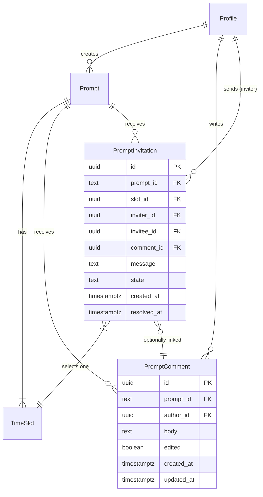

# Comments and Meeting Invitations

Backend-only: schema, domain types, services, API endpoints, and integration tests for the engagement layer — private comments on prompts and meeting invitation flow.

## Overview

Step 4 of the backend implementation sequence (see brainstorm). This is the first engagement primitive: users can comment privately on prompts and invite the prompt author to meet at a specific time slot. Without this, the discover feed has no interactions.

## Problem Statement

The discover feed shows published prompts, but users can't engage with them. There's no way to express interest (comment) or propose a meeting (invitation). The old canvas-based `canvas_comments` and `meeting_invitations` tables reference the legacy model and don't implement the design principles (private single-shot comments, one-per-user, slot-based invitations with expiry).

## Proposed Solution

New `prompt_comments` and `prompt_invitations` tables with proper domain constraints. Service layer following the established interface + implementation pattern. API endpoints under `/api/prompts/[id]/comments` and `/api/prompts/[id]/invitations`. Notification triggers for key events.

(see brainstorm: `docs/brainstorms/2026-03-24-backend-implementation-sequence-brainstorm.md` — Step 4, lines 99-117)

## Technical Approach

### Architecture

```
src/lib/
  domain/
    types.ts              — ADD: Comment, MeetingInvitation, InvitationState
    comment.ts            — Comment invariants (one-per-user validation)
    invitation.ts         — Invitation state machine guards
  services/
    comment.ts            — CommentService interface + SupabaseCommentService
    invitation.ts         — InvitationService interface + SupabaseInvitationService

src/routes/
  api/prompts/[id]/
    comments/+server.ts   — POST (create/edit via upsert), GET (for prompt author)
    invitations/+server.ts — POST (create), DELETE (withdraw)
  api/invitations/[id]/
    accept/+server.ts     — POST (accept → creates meeting placeholder)
    cancel/+server.ts     — POST (cancel by inviter)

supabase/
  migrations/
    20260328_create_comments_invitations.sql
  tests/
    rls_comments.test.sql
    rls_invitations.test.sql
```

### Database Schema

#### `prompt_comments` table

```sql
CREATE TABLE prompt_comments (
  id UUID PRIMARY KEY DEFAULT gen_random_uuid(),
  prompt_id TEXT NOT NULL REFERENCES prompts(id) ON DELETE CASCADE,
  author_id UUID NOT NULL REFERENCES auth.users(id) ON DELETE CASCADE,
  body TEXT NOT NULL CHECK (char_length(body) BETWEEN 1 AND 2000),
  created_at TIMESTAMPTZ NOT NULL DEFAULT NOW(),
  updated_at TIMESTAMPTZ NOT NULL DEFAULT NOW(),
  -- "edited" is derived: updated_at > created_at + interval '1 second'

  -- One comment per user per prompt (design principle)
  CONSTRAINT uq_one_comment_per_user_per_prompt
    UNIQUE (prompt_id, author_id)
);

CREATE INDEX idx_prompt_comments_prompt ON prompt_comments(prompt_id);
```

**RLS — two-party visibility** (commenter sees own; prompt author sees all on their prompt; commenters can't see each other):

```sql
ALTER TABLE prompt_comments ENABLE ROW LEVEL SECURITY;

-- Commenter can manage their own comment
CREATE POLICY "Authors manage own comments"
  ON prompt_comments FOR ALL
  USING ((SELECT auth.uid()) = author_id)
  WITH CHECK ((SELECT auth.uid()) = author_id);

-- Prompt author can read all comments on their prompts
CREATE POLICY "Prompt author reads comments"
  ON prompt_comments FOR SELECT
  USING (
    EXISTS (
      SELECT 1 FROM prompts
      WHERE prompts.id = prompt_comments.prompt_id
      AND prompts.author_id = (SELECT auth.uid())
    )
  );
```

Note: `(SELECT auth.uid())` wrapped in subquery per Supabase performance best practice — prevents per-row re-evaluation.

#### `prompt_invitations` table

```sql
CREATE TABLE prompt_invitations (
  id UUID PRIMARY KEY DEFAULT gen_random_uuid(),
  prompt_id TEXT NOT NULL REFERENCES prompts(id) ON DELETE CASCADE,
  slot_id UUID NOT NULL REFERENCES time_slots(id) ON DELETE CASCADE,
  inviter_id UUID NOT NULL REFERENCES auth.users(id),
  invitee_id UUID NOT NULL REFERENCES auth.users(id),  -- always the prompt author
  comment_id UUID REFERENCES prompt_comments(id),       -- optional link to comment
  message TEXT CHECK (message IS NULL OR char_length(message) BETWEEN 1 AND 500),
  state TEXT NOT NULL DEFAULT 'pending'
    CHECK (state IN ('pending', 'accepted', 'cancelled', 'expired')),
  created_at TIMESTAMPTZ NOT NULL DEFAULT NOW(),
  resolved_at TIMESTAMPTZ,

  -- No plain UNIQUE — use partial index below to allow re-invitation after cancel/expire
);

-- One pending invitation per user per slot (allows re-invitation after cancellation/expiry)
CREATE UNIQUE INDEX uq_one_pending_invitation_per_user_per_slot
  ON prompt_invitations(slot_id, inviter_id)
  WHERE state = 'pending';

CREATE INDEX idx_prompt_invitations_prompt ON prompt_invitations(prompt_id);
CREATE INDEX idx_prompt_invitations_pending ON prompt_invitations(slot_id, state)
  WHERE state = 'pending';
```

**State machine:**

```
pending ──→ accepted   (invitee accepts → slot marked booked, other pending invitations cancelled)
pending ──→ cancelled  (inviter withdraws → free action, no consequences)
pending ──→ expired    (12h before slot start → auto-expiry via cron or check-on-read)
```

Terminal states: `accepted`, `cancelled`, `expired` — no further transitions allowed.

**State transitions:** Enforced at the application layer via domain guards (`canCancel`, `canAccept`) and the `accept_invitation` RPC function. The CHECK constraint on `state` prevents invalid values. `resolved_at` is set explicitly in each transition path (accept function, cancel service, expire function) — not via trigger.

**RLS:**

```sql
ALTER TABLE prompt_invitations ENABLE ROW LEVEL SECURITY;

-- Inviter can create and view their own invitations
CREATE POLICY "Inviter manages own invitations"
  ON prompt_invitations FOR ALL
  USING ((SELECT auth.uid()) = inviter_id)
  WITH CHECK ((SELECT auth.uid()) = inviter_id);

-- Invitee (prompt author) can only READ invitations — acceptance goes through SECURITY DEFINER RPC
CREATE POLICY "Invitee reads invitations"
  ON prompt_invitations FOR SELECT
  USING ((SELECT auth.uid()) = invitee_id);

-- Enforce invitee is always the prompt author (prevents forged invitee_id)
CREATE OR REPLACE FUNCTION check_invitee_is_prompt_author()
RETURNS TRIGGER AS $$
BEGIN
  IF NEW.invitee_id != (SELECT author_id FROM prompts WHERE id = NEW.prompt_id) THEN
    RAISE EXCEPTION 'Invitee must be the prompt author';
  END IF;
  RETURN NEW;
END;
$$ LANGUAGE plpgsql SET search_path = public;

CREATE TRIGGER enforce_invitee_is_prompt_author
  BEFORE INSERT ON prompt_invitations
  FOR EACH ROW EXECUTE FUNCTION check_invitee_is_prompt_author();
```

**Slot acceptance function** (atomic booking with concurrent-access safety):

```sql
CREATE OR REPLACE FUNCTION accept_invitation(p_invitation_id UUID)
RETURNS BOOLEAN
LANGUAGE plpgsql
SECURITY DEFINER
SET search_path = public
AS $$
DECLARE
  v_slot_id UUID;
  v_invitee_id UUID;
  v_slot_accepted BOOLEAN;
BEGIN
  -- Lock invitation
  SELECT slot_id, invitee_id INTO v_slot_id, v_invitee_id
  FROM prompt_invitations
  WHERE id = p_invitation_id AND state = 'pending'
  FOR UPDATE;

  IF NOT FOUND THEN
    RAISE EXCEPTION 'Invitation not found or not pending';
  END IF;

  IF v_invitee_id != (SELECT auth.uid()) THEN
    RAISE EXCEPTION 'Not authorized';
  END IF;

  -- Lock slot and check availability
  SELECT accepted INTO v_slot_accepted
  FROM time_slots WHERE id = v_slot_id FOR UPDATE;

  IF v_slot_accepted THEN
    UPDATE prompt_invitations SET state = 'cancelled' WHERE id = p_invitation_id;
    RETURN FALSE;
  END IF;

  -- Book slot + accept invitation atomically
  UPDATE time_slots SET accepted = TRUE WHERE id = v_slot_id;
  UPDATE prompt_invitations SET state = 'accepted' WHERE id = p_invitation_id;

  -- Cancel all other pending invitations for this slot
  UPDATE prompt_invitations
  SET state = 'cancelled'
  WHERE slot_id = v_slot_id AND id != p_invitation_id AND state = 'pending';

  RETURN TRUE;
END;
$$;
```

**Expiry function** (callable directly for tests, cron deferred like `archive_stale_prompts`):

```sql
CREATE OR REPLACE FUNCTION expire_stale_invitations()
RETURNS INTEGER
LANGUAGE plpgsql
SECURITY DEFINER
SET search_path = public
AS $$
DECLARE
  expired_count INTEGER;
BEGIN
  UPDATE prompt_invitations
  SET state = 'expired'
  WHERE state = 'pending'
    AND slot_id IN (
      SELECT id FROM time_slots
      WHERE start_time - INTERVAL '12 hours' <= NOW()
    );

  GET DIAGNOSTICS expired_count = ROW_COUNT;
  RETURN expired_count;
END;
$$;
```

**Execution restrictions:**

```sql
-- accept_invitation: only authenticated users (prompt authors accepting)
REVOKE EXECUTE ON FUNCTION accept_invitation FROM public;
GRANT EXECUTE ON FUNCTION accept_invitation TO authenticated;

-- expire_stale_invitations: only service_role (cron/tests)
REVOKE EXECUTE ON FUNCTION expire_stale_invitations FROM public;
GRANT EXECUTE ON FUNCTION expire_stale_invitations TO service_role;
```

**Auto-update `updated_at` on comments** (reuse existing function):

```sql
CREATE TRIGGER prompt_comments_updated_at
  BEFORE UPDATE ON prompt_comments
  FOR EACH ROW EXECUTE FUNCTION update_updated_at();
```

**Notification triggers:** Deferred to the notification UI PR. Story 2 requires notifications for: comment received, invitation received, invitation accepted, invitation expired. These are documented requirements, not YAGNI — they will be implemented when the notification frontend ships. See Deferred section below.

The `notifications_type_check` constraint will need to be ALTERed at that time to accept new types (`comment_received`, `invitation_received`, `invitation_accepted`, `invitation_expired`).

#### ERD



### Service Interfaces

#### `src/lib/services/comment.ts`

```typescript
export interface CommentService {
  createOrUpdate(promptId: string, authorId: string, body: string): Promise<Comment>;
  getForPromptAuthor(promptId: string, authorId: string): Promise<Comment[]>;
  // authorId here is the prompt author — returns all comments on their prompt
  getMyComment(promptId: string, userId: string): Promise<Comment | null>;
  // Returns the user's own comment on a specific prompt
}
```

Uses upsert (`ON CONFLICT DO UPDATE`) for the create/edit pattern. Sets `edited = true` on update.

#### `src/lib/services/invitation.ts`

```typescript
export interface InvitationService {
  create(params: {
    promptId: string;
    slotId: string;
    inviterId: string;
    inviteeId: string;
    commentId?: string;
    message?: string;
  }): Promise<MeetingInvitation>;

  cancel(invitationId: string, inviterId: string): Promise<void>;
  accept(invitationId: string, inviteeId: string): Promise<boolean>;
  // Returns true if accepted, false if slot was already booked

  getPendingForPrompt(promptId: string, userId: string): Promise<MeetingInvitation[]>;
  // For prompt author: see all pending invitations on their prompt
  // For inviter: see their own pending invitation
}
```

`accept` calls the `accept_invitation` RPC function for atomic slot booking.

### Domain Types

Add to `src/lib/domain/types.ts`:

```typescript
export type InvitationState = 'pending' | 'accepted' | 'cancelled' | 'expired';

export interface Comment {
  id: string;
  prompt_id: string;
  author_id: string;
  body: string;
  created_at: string;
  updated_at: string;
  // "edited" derived in UI: updated_at > created_at
}

export interface MeetingInvitation {
  id: string;
  prompt_id: string;
  slot_id: string;
  inviter_id: string;
  invitee_id: string;
  comment_id: string | null;
  message: string | null;
  state: InvitationState;
  created_at: string;
  resolved_at: string | null;
}
```

### Domain Logic

#### `src/lib/domain/engagement.ts`

All engagement guards in one file (comments and invitations are prompt-scoped):

```typescript
export function canComment(prompt: Prompt, userId: string): boolean {
  return prompt.state === 'published' && prompt.author_id !== userId;
}

export function canInvite(prompt: Prompt, slot: TimeSlot, userId: string): boolean {
  return prompt.state === 'published' && prompt.author_id !== userId && isAvailable(slot);
}

export function canCancel(invitation: MeetingInvitation, userId: string): boolean {
  return invitation.state === 'pending' && invitation.inviter_id === userId;
}

export function canAccept(invitation: MeetingInvitation, userId: string): boolean {
  return invitation.state === 'pending' && invitation.invitee_id === userId;
}
```

### Implementation Phases

#### Phase 1: Schema + Domain + Services

- [x] `supabase/migrations/20260328_create_comments_invitations.sql` — both tables, RLS, indexes, `accept_invitation` function, `expire_stale_invitations` function, invitee enforcement trigger, execution restrictions
- [x] `src/lib/domain/types.ts` — add Comment, MeetingInvitation, InvitationState
- [x] `src/lib/domain/engagement.ts` — canComment, canInvite, canCancel, canAccept guards
- [x] `src/lib/domain/engagement.test.ts` — unit tests for all guards
- [x] `src/lib/services/comment.ts` — CommentService interface + SupabaseCommentService (upsert, two-party queries)
- [x] `src/lib/services/invitation.ts` — InvitationService interface + SupabaseInvitationService (create, cancel, accept via RPC, pending queries)
- [x] Update `tests/helpers/db.ts` — add CommentService + InvitationService to factory
- [x] Update `src/lib/services/prompt-command.ts` — add pending-invitation check to `editSlot` and `removeSlot` (slot locking)
- [x] Update `supabase/seed.sql` — add seed comments and invitations for testing

#### Phase 2: API Endpoints + Integration Tests

- [x] `POST /api/prompts/[id]/comments` — create or edit comment (upsert). `author_id` from session, never request body.
- [x] `GET /api/prompts/[id]/comments` — prompt author sees all; others see own
- [x] `POST /api/prompts/[id]/invitations` — create invitation (select slot + message)
- [x] `DELETE /api/invitations/[id]` — withdraw pending invitation
- [ ] `POST /api/invitations/[id]/accept` — accept invitation (calls RPC)
- [ ] `supabase/tests/rls_comments.test.sql` — two-party visibility, one-per-user enforcement, can't comment on own prompt
- [ ] `supabase/tests/rls_invitations.test.sql` — inviter/invitee visibility, slot booking atomicity
- [x] `tests/integration/comment-lifecycle.test.ts` — create, edit (upsert sets updated_at), author visibility, cross-user invisibility
- [x] `tests/integration/invitation-lifecycle.test.ts` — create, cancel, accept (slot marked booked, other invitations cancelled), expire via function call

## Acceptance Criteria

### Functional Requirements

- [ ] User can comment on a published prompt they don't own (one comment per prompt, editable)
- [ ] Prompt author sees all comments on their prompts; commenters see only their own
- [ ] User can invite prompt author to meet at a specific time slot with an optional message
- [ ] Inviter can withdraw a pending invitation (free action)
- [ ] Prompt author can accept an invitation — slot is atomically marked as booked
- [ ] Accepting a booked slot returns false (concurrent safety)
- [ ] Other pending invitations for the same slot are cancelled on acceptance
- [ ] `expire_stale_invitations()` expires pending invitations 12h before slot start
- [ ] Notification created when: comment received, invitation received
- [ ] Comment body is plain text (not TipTap JSON — per design principles, keep it basic)

### Non-Functional Requirements

- [ ] Two-party RLS on comments (commenter + prompt author only)
- [ ] Invitation state transitions enforced via domain guards + CHECK constraint
- [ ] Slot booking uses `SELECT ... FOR UPDATE` for concurrent-access safety
- [ ] `accept_invitation` and `expire_stale_invitations` have `SET search_path = public` and execution restrictions
- [ ] `invitee_id = prompts.author_id` enforced at database level
- [ ] All endpoints require authentication; `author_id` sourced from session, never request body
- [ ] UNIQUE constraint enforces one-comment-per-user-per-prompt
- [ ] Comment body max 2000 chars, invitation message max 500 chars (CHECK constraints)
- [ ] `editSlot` and `removeSlot` reject changes when pending invitations exist for the slot

### Quality Gates

- [ ] Domain guards have unit tests
- [ ] Integration tests cover full comment and invitation lifecycles
- [ ] pgTAP tests verify RLS for both tables
- [ ] `accept_invitation` RPC tested for concurrent scenarios
- [ ] `tests/helpers/db.ts` factory updated with CommentService + InvitationService
- [ ] `editSlot`/`removeSlot` reject when pending invitations exist (slot locking)

## Dependencies & Risks

- **Depends on**: Prompt schema (done), time_slots table (done), `archive_stale_prompts` pattern (done — same pattern reused for `expire_stale_invitations`)
- **Notification type constraint**: The existing `notifications_type_check` must be ALTERed to include new types. This is a schema change on an existing table.
- **No frontend in this PR**: All backend-only. Frontend (comment panel on discover, invitation flow) is separate.
- **Comment body is plain text**: The design principles say "keep it basic". Using `TEXT` not `JSONB` for comment body, unlike prompt body which uses TipTap JSON.

## Decisions Made for This Plan

| Question | Decision | Rationale |
|----------|----------|-----------|
| Comment body format? | Plain text (not TipTap JSON), max 2000 chars | Design principle: "keep it basic". Comments are short messages, not rich content. |
| `edited` column? | No — derive from `updated_at > created_at` | Avoids extra column; same information computable from timestamps. |
| One table or two? | Two separate tables (`prompt_comments`, `prompt_invitations`) | Different access patterns, different RLS rules, different lifecycles |
| Upsert for comments? | Yes — `ON CONFLICT (prompt_id, author_id) DO UPDATE` | Simplifies the create/edit API to a single endpoint. |
| Invitation uniqueness? | Partial unique index `WHERE state = 'pending'` | Allows re-invitation after cancellation/expiry. Plain UNIQUE would block re-invites. |
| One-per-prompt or one-per-slot? | One pending per slot | Per-slot is correct per Story 2 (inviter picks ONE slot). DDD plan text says per-prompt — update DDD plan. |
| Commenting required before inviting? | No — `comment_id` is nullable | Story flow is sequential (comment then invite) but not enforced. Design principles allow comments without inviting; inviting without commenting is also valid. |
| Slot booking mechanism? | `SELECT ... FOR UPDATE` in a SECURITY DEFINER function with `SET search_path = public` | Serializes concurrent acceptances. Restricted to `authenticated` role. |
| Expiry mechanism? | Callable function restricted to `service_role` + deferred cron | Same pattern as `archive_stale_prompts`. Tests call via admin client. |
| State transition enforcement? | Application layer (domain guards + CHECK constraint) | Trigger removed per simplicity review. `resolved_at` set explicitly in each transition path. |
| Invitee mutations? | `FOR SELECT` RLS only — all invitee mutations through SECURITY DEFINER RPC | Prevents fabricated invitations. `invitee_id = prompt.author_id` enforced by trigger. |
| `accept_invitation` in Step 4 or 5? | Step 4 — slot booking is Engagement context | Step 5 extends to create Meeting record. Accepted invitations are "dangling" until then. Pragmatic cross-context write to `time_slots.accepted` is documented. |
| Notification triggers? | Deferred to notification UI PR | Required by Story 2 (not YAGNI) but no consumer until frontend ships. See Deferred section. |

## Deferred (Required, Not in This PR)

These are documented requirements from the user stories and design docs. They are not YAGNI — they will be implemented in subsequent PRs. Each is tagged with its requirement source.

| Item | Source | Deferred to |
|------|--------|-------------|
| Notification triggers: comment received, invitation received, invitation accepted, invitation expired | Story 2 (steps 2, 7, 13, 15), DDD plan domain events | Notification UI PR |
| Exact location reveal to inviter post-acceptance | Story 2 (step 19), design principles (location privacy) | Step 5 (Meetings) |
| Meeting entity creation on acceptance | DDD plan (MeetingFactory), Story 2 (step 11) | Step 5 (Meetings) |
| Calendar event link generation | Story 2 (step 20) | Step 5 or later |
| Slot conflict filtering (prevent Tom double-booking) | Story 2 (step 12), design principles | Step 5 or engagement frontend PR |
| Contact info sanitization in comment/message text | Design principles ("no pre-meeting contact") | Moderation PR (Step 8) |
| Comment deletion endpoint | Not in story requirements | Add if needed |
| Pending invitation resolution on prompt archival | Design principles ("unpublishing resolves active invitations") | Extend `archive_stale_prompts` or add trigger — next PR after this |

## Sources & References

### Origin

- **Brainstorm:** `docs/brainstorms/2026-03-24-backend-implementation-sequence-brainstorm.md` — Step 4 (lines 99-117). Key decisions: new tables from scratch, CommentService + InvitationService, notification triggers.

### Internal References

- `docs/stories/002-discover-engage-schedule-meeting.md` — Story 2 requirements for comments and invitations
- `docs/design/design-principles.md` — "Comments Are Private, Single-Shot Messages", "No Pre-Meeting Contact"
- `docs/plans/2026-03-24-feat-domain-driven-design-plan.md` — Engagement bounded context, Comment entity, MeetingInvitation aggregate
- `docs/solutions/architecture/service-layer-and-test-portability-patterns.md` — Service interface pattern, RLS testing patterns, GoTrue gotchas
- `src/lib/services/prompt-command.ts` — Established service pattern to follow
- `supabase/migrations/20260327_auto_archive_prompts.sql` — `archive_stale_prompts()` pattern reused for invitation expiry

### External References

- [PostgreSQL INSERT ON CONFLICT](https://www.postgresql.org/docs/current/sql-insert.html)
- [PostgreSQL FOR UPDATE locking](https://www.postgresql.org/docs/current/explicit-locking.html)
- [Supabase RLS performance: `(SELECT auth.uid())` optimization](https://supabase.com/docs/guides/database/postgres/row-level-security)
- [Database state machines — Lawrence Jones](https://blog.lawrencejones.dev/state-machines/)
