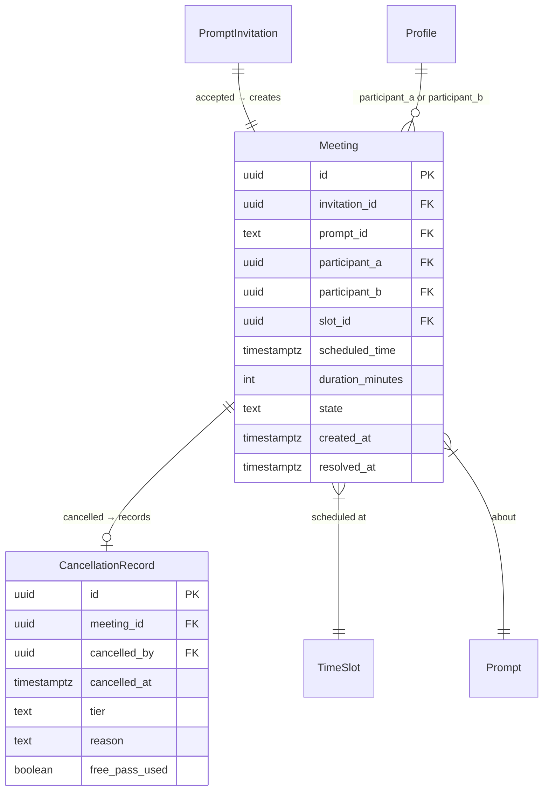

# Meetings Backend

Backend-only: meeting entity creation on invitation acceptance, cancellation with symmetric tiers, exact location reveal, and meeting state machine.

## Overview

Step 5 of the backend implementation sequence (see brainstorm lines 119-132). When a prompt author accepts an invitation, a Meeting record is created with the exact location revealed to both participants. Either party can cancel with symmetric tier rules (early ≥12h with explanation, late <12h with reputation consequences). Meetings transition to `awaiting_feedback` when the scheduled time passes (preparing for Step 6).

## Problem Statement

Step 4 added invitation acceptance that books a slot atomically, but no Meeting entity is created. The `accept_invitation` function currently returns a boolean — the caller has no meeting record, no revealed location, no cancellation capability. Story 2 requires exact location reveal on acceptance, and Story 4 requires a meeting lifecycle with cancellation and feedback gates.

## Proposed Solution

Extend `accept_invitation` to also create a Meeting record (atomic, same transaction). Add a `meetings` table with a state machine, a `cancellation_records` table for tier-based cancellation audit, and a `cancel_meeting` SECURITY DEFINER function with symmetric tier logic. Location is revealed by reading from the meeting's linked time slot via a controlled RPC function.

(see brainstorm: `docs/brainstorms/2026-03-24-backend-implementation-sequence-brainstorm.md` — Step 5, lines 119-132)

## Technical Approach

### Architecture

```
supabase/migrations/
  20260329_create_meetings.sql           — meetings + cancellation_records tables, RLS,
                                           cancel_meeting function, advance_scheduled_meetings function
  20260330_extend_accept_with_meeting.sql — extend accept_invitation to create meeting + return UUID

src/lib/
  domain/
    types.ts              — ADD: Meeting, MeetingState, CancellationRecord, CancellationTier
    meeting.ts            — Meeting state machine guards, cancellation tier derivation
  services/
    meeting.ts            — MeetingService interface + SupabaseMeetingService

src/routes/
  api/meetings/
    +server.ts            — GET (list my meetings)
  api/meetings/[id]/
    +server.ts            — GET (meeting detail with location for active, without for cancelled)
    cancel/+server.ts     — POST (cancel with tier logic)
  api/invitations/[id]/
    accept/+server.ts     — UPDATE: return meeting ID instead of boolean

supabase/migrations/
  20260329_fix_time_slots_exact_location_access.sql — PREREQUISITE: revoke direct SELECT on time_slots, grant only on view
```

### Database Schema

#### `meetings` table

```sql
CREATE TABLE meetings (
  id UUID PRIMARY KEY DEFAULT gen_random_uuid(),
  invitation_id UUID NOT NULL UNIQUE REFERENCES prompt_invitations(id),
  prompt_id TEXT NOT NULL REFERENCES prompts(id) ON DELETE RESTRICT,  -- must cancel meetings before deleting prompt
  participant_a UUID NOT NULL REFERENCES auth.users(id),  -- prompt author (invitee)
  participant_b UUID NOT NULL REFERENCES auth.users(id),  -- inviter
  CONSTRAINT no_self_meeting CHECK (participant_a != participant_b),
  slot_id UUID NOT NULL REFERENCES time_slots(id),
  scheduled_time TIMESTAMPTZ NOT NULL,
  duration_minutes INTEGER NOT NULL,
  state TEXT NOT NULL DEFAULT 'scheduled'
    CHECK (state IN ('scheduled', 'cancelled_early', 'cancelled_late', 'awaiting_feedback', 'completed')),
  created_at TIMESTAMPTZ NOT NULL DEFAULT NOW(),
  resolved_at TIMESTAMPTZ
);

CREATE INDEX idx_meetings_participants ON meetings(participant_a, participant_b);
CREATE INDEX idx_meetings_scheduled ON meetings(state, scheduled_time)
  WHERE state = 'scheduled';
```

**State machine:**

```
scheduled ──→ cancelled_early   (either party cancels ≥12h before, explanation required)
scheduled ──→ cancelled_late    (either party cancels <12h before, reputation consequences)
scheduled ──→ awaiting_feedback (scheduled_time passes, feedback gate activates)
awaiting_feedback ──→ completed (both feedbacks submitted — Step 6 scope)
```

**RLS:** Both participants can read their own meetings. State mutations through SECURITY DEFINER functions only.

```sql
ALTER TABLE meetings ENABLE ROW LEVEL SECURITY;

CREATE POLICY "Participants read own meetings"
  ON meetings FOR SELECT
  USING (
    (SELECT auth.uid()) IN (participant_a, participant_b)
  );
```

No direct INSERT/UPDATE/DELETE for authenticated users — all mutations through RPC functions.

#### `cancellation_records` table

```sql
CREATE TABLE cancellation_records (
  id UUID PRIMARY KEY DEFAULT gen_random_uuid(),
  meeting_id UUID NOT NULL UNIQUE REFERENCES meetings(id),
  cancelled_by UUID NOT NULL REFERENCES auth.users(id),
  cancelled_at TIMESTAMPTZ NOT NULL DEFAULT NOW(),
  tier TEXT NOT NULL CHECK (tier IN ('early', 'late')),
  reason TEXT CHECK (reason IS NULL OR char_length(reason) BETWEEN 10 AND 2000),
  CONSTRAINT reason_required_for_early CHECK (tier != 'early' OR reason IS NOT NULL),
  free_pass_used BOOLEAN NOT NULL DEFAULT FALSE
);

ALTER TABLE cancellation_records ENABLE ROW LEVEL SECURITY;

CREATE POLICY "Participants read own cancellation records"
  ON cancellation_records FOR SELECT
  USING (
    EXISTS (
      SELECT 1 FROM meetings
      WHERE meetings.id = cancellation_records.meeting_id
      AND (SELECT auth.uid()) IN (meetings.participant_a, meetings.participant_b)
    )
  );
```

#### Extend `accept_invitation` — return meeting UUID

New migration replaces the function. Return type changes from `BOOLEAN` to `UUID` (meeting ID on success, NULL if slot already booked).

```sql
CREATE OR REPLACE FUNCTION accept_invitation(p_invitation_id UUID)
RETURNS UUID
LANGUAGE plpgsql
SECURITY DEFINER
SET search_path = public
AS $$
DECLARE
  v_slot_id UUID;
  v_invitee_id UUID;
  v_slot_accepted BOOLEAN;
  v_meeting_id UUID;
BEGIN
  -- [existing lock + check logic unchanged]
  SELECT slot_id, invitee_id INTO v_slot_id, v_invitee_id
  FROM prompt_invitations
  WHERE id = p_invitation_id AND state = 'pending'
  FOR UPDATE;

  IF NOT FOUND THEN RAISE EXCEPTION 'Invitation not found or not pending'; END IF;
  IF v_invitee_id != (SELECT auth.uid()) THEN RAISE EXCEPTION 'Not authorized'; END IF;

  SELECT accepted INTO v_slot_accepted FROM time_slots WHERE id = v_slot_id FOR UPDATE;

  IF v_slot_accepted THEN
    UPDATE prompt_invitations SET state = 'cancelled', resolved_at = NOW()
    WHERE id = p_invitation_id;
    RETURN NULL;
  END IF;

  -- Book slot + accept invitation
  UPDATE time_slots SET accepted = TRUE WHERE id = v_slot_id;
  UPDATE prompt_invitations SET state = 'accepted', resolved_at = NOW()
  WHERE id = p_invitation_id;

  -- Cancel competing invitations
  UPDATE prompt_invitations SET state = 'cancelled', resolved_at = NOW()
  WHERE slot_id = v_slot_id AND id != p_invitation_id AND state = 'pending';

  -- Create meeting (NEW)
  INSERT INTO meetings (invitation_id, prompt_id, participant_a, participant_b,
                        slot_id, scheduled_time, duration_minutes)
  SELECT pi.invitee_id, pi.prompt_id, pi.invitee_id, pi.inviter_id,
         pi.slot_id, ts.start_time, ts.duration_minutes
  FROM prompt_invitations pi
  JOIN time_slots ts ON ts.id = pi.slot_id
  WHERE pi.id = p_invitation_id
  RETURNING id INTO v_meeting_id;

  RETURN v_meeting_id;
END;
$$;
```

#### `cancel_meeting` function

```sql
CREATE OR REPLACE FUNCTION cancel_meeting(p_meeting_id UUID, p_reason TEXT DEFAULT NULL)
RETURNS TEXT  -- returns the tier ('early' or 'late')
LANGUAGE plpgsql
SECURITY DEFINER
SET search_path = public
AS $$
DECLARE
  v_meeting meetings%ROWTYPE;
  v_tier TEXT;
  v_caller UUID := (SELECT auth.uid());
  v_free_pass BOOLEAN := FALSE;
  v_late_count INTEGER;
BEGIN
  SELECT * INTO v_meeting FROM meetings
  WHERE id = p_meeting_id AND state = 'scheduled'
  FOR UPDATE;

  IF NOT FOUND THEN RAISE EXCEPTION 'Meeting not found or not cancellable'; END IF;
  IF v_caller NOT IN (v_meeting.participant_a, v_meeting.participant_b) THEN
    RAISE EXCEPTION 'Not a participant';
  END IF;

  -- Compute tier from time until meeting
  IF v_meeting.scheduled_time - INTERVAL '12 hours' > NOW() THEN
    v_tier := 'early';
  ELSE
    v_tier := 'late';
  END IF;

  -- Early requires explanation
  IF v_tier = 'early' AND (p_reason IS NULL OR char_length(p_reason) < 10) THEN
    RAISE EXCEPTION 'Early cancellation requires an explanation (min 10 characters)';
  END IF;

  -- Free pass check for late cancellations
  IF v_tier = 'late' THEN
    SELECT COUNT(*) INTO v_late_count
    FROM cancellation_records cr
    WHERE cr.cancelled_by = v_caller AND cr.tier = 'late';
    IF v_late_count = 0 THEN
      v_free_pass := TRUE;
    END IF;
  END IF;

  -- Transition meeting state
  UPDATE meetings
  SET state = CASE WHEN v_tier = 'early' THEN 'cancelled_early' ELSE 'cancelled_late' END,
      resolved_at = NOW()
  WHERE id = p_meeting_id;

  -- Record cancellation
  INSERT INTO cancellation_records (meeting_id, cancelled_by, tier, reason, free_pass_used)
  VALUES (p_meeting_id, v_caller, v_tier, p_reason, v_free_pass);

  -- Early cancellation: release slot back to available
  IF v_tier = 'early' THEN
    UPDATE time_slots SET accepted = FALSE WHERE id = v_meeting.slot_id;
  END IF;

  RETURN v_tier;
END;
$$;

REVOKE EXECUTE ON FUNCTION cancel_meeting FROM public;
GRANT EXECUTE ON FUNCTION cancel_meeting TO authenticated;
```

#### `advance_scheduled_meetings` function

Transitions meetings to `awaiting_feedback` when scheduled_time passes. Callable directly for tests, cron deferred.

```sql
CREATE OR REPLACE FUNCTION advance_scheduled_meetings()
RETURNS INTEGER
LANGUAGE plpgsql
SECURITY DEFINER
SET search_path = public
AS $$
DECLARE
  activated_count INTEGER;
BEGIN
  UPDATE meetings
  SET state = 'awaiting_feedback', resolved_at = NOW()
  WHERE state = 'scheduled' AND scheduled_time <= NOW();

  GET DIAGNOSTICS activated_count = ROW_COUNT;
  RETURN activated_count;
END;
$$;

REVOKE EXECUTE ON FUNCTION advance_scheduled_meetings FROM public;
GRANT EXECUTE ON FUNCTION advance_scheduled_meetings TO service_role;
```

#### Location Reveal

Exact location is accessed via a SECURITY DEFINER function that checks participation + meeting state:

```sql
CREATE OR REPLACE FUNCTION get_meeting_with_location(p_meeting_id UUID)
RETURNS TABLE (
  id UUID, invitation_id UUID, prompt_id TEXT,
  participant_a UUID, participant_b UUID,
  scheduled_time TIMESTAMPTZ, duration_minutes INTEGER,
  state TEXT, created_at TIMESTAMPTZ,
  exact_location JSONB, general_area TEXT
)
LANGUAGE plpgsql
SECURITY DEFINER
SET search_path = public
AS $$
BEGIN
  RETURN QUERY
  SELECT m.id, m.invitation_id, m.prompt_id,
         m.participant_a, m.participant_b,
         m.scheduled_time, m.duration_minutes,
         m.state, m.created_at,
         ts.exact_location, ts.general_area
  FROM meetings m
  JOIN time_slots ts ON ts.id = m.slot_id
  WHERE m.id = p_meeting_id
    AND (SELECT auth.uid()) IN (m.participant_a, m.participant_b)
    AND m.state NOT IN ('cancelled_early', 'cancelled_late');
END;
$$;

REVOKE EXECUTE ON FUNCTION get_meeting_with_location FROM public;
GRANT EXECUTE ON FUNCTION get_meeting_with_location TO authenticated;
```

### Domain Types

Add to `src/lib/domain/types.ts`:

```typescript
export type MeetingState = 'scheduled' | 'cancelled_early' | 'cancelled_late' | 'awaiting_feedback' | 'completed';
export type CancellationTier = 'early' | 'late';

export interface Meeting {
  id: string;
  invitation_id: string;
  prompt_id: string;
  participant_a: string;
  participant_b: string;
  scheduled_time: string;
  duration_minutes: number;
  state: MeetingState;
  created_at: string;
  resolved_at: string | null;
}

export interface MeetingWithLocation extends Meeting {
  exact_location: LocationRef;
  general_area: string;
}

export interface CancellationRecord {
  id: string;
  meeting_id: string;
  cancelled_by: string;
  cancelled_at: string;
  tier: CancellationTier;
  reason: string | null;
  free_pass_used: boolean;
}
```

### Domain Logic — `src/lib/domain/meeting.ts`

```typescript
export function canCancel(meeting: Meeting, userId: string): boolean {
  return meeting.state === 'scheduled'
    && (meeting.participant_a === userId || meeting.participant_b === userId);
}

export function deriveCancellationTier(meeting: Meeting, now: Date = new Date()): CancellationTier {
  const cutoff = new Date(new Date(meeting.scheduled_time).getTime() - 12 * 60 * 60 * 1000);
  return now < cutoff ? 'early' : 'late';
}

export function isAwaitingFeedback(meeting: Meeting, now: Date = new Date()): boolean {
  return meeting.state === 'scheduled' && new Date(meeting.scheduled_time) <= now;
}
```

### Service Interface — `src/lib/services/meeting.ts`

```typescript
export interface MeetingService {
  getWithLocation(meetingId: string): Promise<MeetingWithLocation | null>;
  getMyMeetings(userId: string): Promise<Meeting[]>;
  cancel(meetingId: string, reason?: string): Promise<CancellationTier>;
}
```

`accept` stays on `InvitationService` — it now returns a meeting ID instead of boolean.

### Implementation Phases

#### Phase 0: Prerequisite — Fix time_slots exact_location access

- [x] `supabase/migrations/20260329_fix_time_slots_exact_location_access.sql` — REVOKE SELECT on `time_slots` from `authenticated`, grant SELECT only on `time_slots_public` view. Prompt authors retain full access via `FOR ALL` RLS policy. This is a pre-existing security gap (exact_location readable by any authenticated user via direct table query).

#### Phase 1: Schema + Domain + Services

- [x] `supabase/migrations/20260330_create_meetings.sql` — meetings table (ON DELETE RESTRICT for prompt_id, no_self_meeting CHECK), cancellation_records table, RLS, cancel_meeting function, advance_scheduled_meetings function, get_meeting_with_location + get_meeting_detail functions, execution restrictions
- [x] `supabase/migrations/20260331_extend_accept_with_meeting.sql` — replace accept_invitation to create meeting + return UUID + guard against expired invitations (reject if slot starts within 12h)
- [x] `src/lib/domain/types.ts` — add Meeting, MeetingWithLocation, MeetingState, CancellationRecord, CancellationTier
- [x] `src/lib/domain/meeting.ts` — canCancel, deriveCancellationTier, isAwaitingFeedback guards
- [ ] `src/lib/domain/meeting.test.ts` — unit tests for all guards
- [x] `src/lib/services/meeting.ts` — MeetingService interface + SupabaseMeetingService
- [x] Update `src/lib/services/invitation.ts` — accept returns `string | null` (meeting ID) instead of boolean
- [x] Update `tests/helpers/db.ts` — add MeetingService to factory
- [ ] Update `supabase/seed.sql` — add a seed meeting (accepted invitation → meeting)

#### Phase 2: API Endpoints + Integration Tests

- [x] Update `POST /api/invitations/[id]/accept` — return meeting ID + details
- [x] `GET /api/meetings` — list my meetings (both participants)
- [x] `GET /api/meetings/[id]` — meeting detail: active meetings get exact location, cancelled meetings get general area + cancellation info
- [x] `POST /api/meetings/[id]/cancel` — cancel with optional reason
- [ ] `supabase/tests/rls_meetings.test.sql` — participant visibility, no direct mutations, cancellation record access
- [x] `tests/integration/meeting-lifecycle.test.ts` — accept creates meeting, cancel (early/late tiers), location reveal, slot release on early cancel, advance_scheduled_meetings function
- [x] Update `tests/integration/invitation-lifecycle.test.ts` — accept now returns meeting ID

## Acceptance Criteria

### Functional Requirements

- [ ] Accepting an invitation atomically creates a Meeting record with state `scheduled`
- [ ] Both participants can view the meeting with exact location revealed (via RPC)
- [ ] Either participant can cancel a scheduled meeting
- [ ] Early cancellation (≥12h) requires explanation ≥10 chars, releases slot
- [ ] Late cancellation (<12h) records reputation consequence, slot stays booked
- [ ] Free pass: first late cancellation per user uses free pass (no reputation mark)
- [ ] `advance_scheduled_meetings()` transitions meetings to `awaiting_feedback` when scheduled_time passes
- [ ] Cancellation is symmetric — same rules for both participants
- [ ] Both participants can list their meetings via `GET /api/meetings`
- [ ] Cancelled meetings visible with general area only (no exact location)
- [ ] `accept_invitation` rejects invitations where slot starts within 12h
- [ ] `time_slots` base table SELECT revoked from authenticated — only view accessible

### Non-Functional Requirements

- [ ] All SECURITY DEFINER functions have `SET search_path = public`
- [ ] `cancel_meeting` and `get_meeting_with_location` restricted to `authenticated`
- [ ] `advance_scheduled_meetings` restricted to `service_role`
- [ ] Meeting RLS is `FOR SELECT` only — all mutations through RPC
- [ ] Tier computed server-side, never from client input

### Quality Gates

- [ ] Domain guards have unit tests (canCancel, deriveCancellationTier, isAwaitingFeedback)
- [ ] Integration tests cover full meeting lifecycle
- [ ] pgTAP tests verify meeting RLS and cancellation record access
- [ ] `accept_invitation` return type change verified in existing invitation tests

## Deferred (Required, Not in This PR)

| Item | Source | Deferred to |
|------|--------|-------------|
| Feedback forms + gate enforcement | Story 4, DDD plan (Feedback context) | Step 6 |
| `completed` state transition (both feedbacks submitted) | Story 4 | Step 6 |
| Notification triggers (meeting scheduled, cancelled) | Story 2/4 | Notification UI PR |
| Calendar event link generation | Story 2 (step 20) | Later |
| No-show detection + moderation case creation | Story 4, DDD plan | Step 8 |
| No-show counting against free pass allowance | Story 4, design principles | Step 8 (ordering dependency: free pass query must include no-shows) |
| Slot conflict check (user has meeting at overlapping time) | Story 2 (step 12) | Frontend PR or next backend step |
| Account deletion with active meetings | Design principles, Story 4 | Account deletion handler must call `cancel_meeting` per active meeting. `cancel_meeting` requires `auth.uid()` — needs service_role variant or app-layer orchestration. |
| Early cancel releasing slot doesn't un-archive prompt | Design principles ("prompt reappears") | Prompt lifecycle step — if prompt was archived due to all slots booked, early cancel freeing a slot should trigger un-archive |
| Competing invitations not restored when slot is released | SpecFlow analysis | Known limitation — cancelled invitations stay cancelled, users must re-invite manually |
| Book/cancel cycling rate limit | Security review, design principles (slot-blocking concern) | Design review — no limit on early cancellations currently. Infrastructure exists via cancellation_records audit trail. |

### Known design decisions (documented for future reference)

- **Free pass scope**: Global per user, permanent. One free late cancellation ever. No rolling window. Revisit based on usage.
- **Free pass effect**: Recorded in `cancellation_records.free_pass_used` but has no behavioral effect in Step 5. Consumed by Step 6/8 for reputation signal computation.
- **Cross-context coupling**: `cancel_meeting` writes `time_slots.accepted = FALSE` directly (Meeting → Content context). Pragmatic for atomicity. Migration path: domain events when the system matures.
- **`advance_scheduled_meetings` scope**: Only transitions meeting state. Does NOT create feedback forms (Step 6 responsibility). Named neutrally to reflect actual behavior.
- **DDD plan deviation**: DDD plan shows `exact_location` stored on Meeting entity. Implementation uses JOIN-based reveal from `time_slots` — single source of truth, no duplication.

## Decisions Made for This Plan

| Question | Decision | Rationale |
|----------|----------|-----------|
| Extend `accept_invitation` or separate function? | Extend — add meeting INSERT inside existing function | Atomicity: slot booking + invitation acceptance + meeting creation must be one transaction |
| Return type of `accept_invitation`? | Change from `BOOLEAN` to `UUID` (meeting ID or NULL) | Caller needs the meeting ID to redirect/display details |
| Location reveal mechanism? | SECURITY DEFINER RPC `get_meeting_with_location` | Controlled access path, no RLS performance hit, no view changes |
| Cancellation tier computation? | Server-side in `cancel_meeting` function | Cannot trust client to determine tier correctly |
| Free pass tracking? | Query user's cancellation history in the cancel function | Keeps logic atomic, cannot be bypassed |
| Early cancel slot release? | Yes — set `time_slots.accepted = FALSE` | Prompt reappears with the freed slot per design principles |
| Late cancel slot release? | No — slot stays booked | Meeting happened (or should have), slot is consumed |
| State transition trigger? | No — application guards + CHECK constraint | Consistent with Step 4 decision; `resolved_at` set explicitly |
| `awaiting_feedback` transition? | Callable function + deferred cron (same pattern as archival/expiry) | Tests call directly; cron for production |
| Meeting table stores exact_location? | No — reads from time_slots via JOIN in RPC | Avoids data duplication; location stays in one place |

## ERD



## Sources & References

### Origin

- **Brainstorm:** `docs/brainstorms/2026-03-24-backend-implementation-sequence-brainstorm.md` — Step 5 (lines 119-132). Key decisions: meetings table split from invitations, MeetingFactory.createFromInvitation, symmetric cancellation.

### Internal References

- `docs/stories/002-discover-engage-schedule-meeting.md` — Post-acceptance flow (location reveal, calendar)
- `docs/stories/004-meeting-feedback-loop.md` — Meeting lifecycle, cancellation tiers, feedback gate
- `docs/design/design-principles.md` — Symmetric cancellation, no pre-meeting contact, location privacy
- `docs/plans/2026-03-24-feat-domain-driven-design-plan.md` — Meeting bounded context (lines 304-373)
- `docs/plans/2026-03-25-feat-comments-and-invitations-plan.md` — Step 4 (accept_invitation function being extended)
- `docs/solutions/architecture/service-layer-and-test-portability-patterns.md` — SECURITY DEFINER patterns, service interfaces

### External References

- [Database state machines — Lawrence Jones](https://blog.lawrencejones.dev/state-machines/)
- [PostgreSQL FOR UPDATE locking](https://www.postgresql.org/docs/current/explicit-locking.html)
- [Supabase SECURITY DEFINER with SET search_path](https://supabase.com/docs/guides/database/functions)
