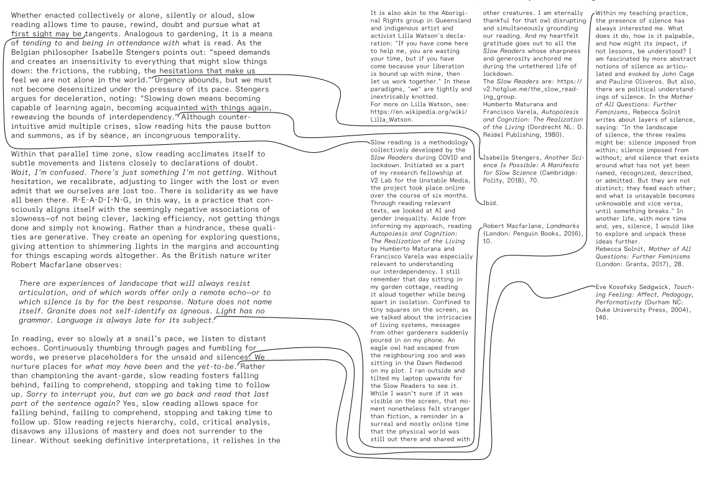

# feat: Organic Layout with Snaking Connection Lines

## Overview

Transform the spatial reader into a newspaper/broadsheet-style layout where cards align typographically and connection lines snake around obstacles using orthogonal routing. Once created, cards and lines have **fixed positions** (pen-and-paper model).

## Design Principles

### 1. Immutable Positioning (Pen-and-Paper Model)
- When a link is clicked, a card and line are created
- Once created, positions are **frozen forever**
- No repositioning, no layout recalculation
- New elements must find space around existing ones

### 2. Typographic Alignment (Broadsheet Style)
- Cards align on a virtual grid
- Left edge to left edge alignment (columns)
- Top edge to top edge alignment where possible
- Creates visual rhythm like newspaper columns

### 3. Horizontal Line Exit
- Lines originate from the underline of the source link
- Lines exit horizontally to the right (between text lines)
- Lines don't turn until they've cleared the origin card
- Maintains readability by not crossing text

### 4. Obstacle Avoidance
- Lines never intersect other cards after leaving origin
- Lines never cross other lines
- Clean orthogonal (90°) routing around obstacles

---

## Reference



The reference shows:
- Column-based card arrangement
- Lines exit cards horizontally to the right
- Orthogonal routing with smooth turns
- Lines snake between cards without crossing content

---

## Implementation Plan

### Phase 1: Horizontal Line Exit from Link Position

**Goal:** Lines emerge from link underline and exit horizontally to the right

**File:** `src/lib/components/NoteCard.svelte`

Current behavior: Line starts at link center
New behavior: Line starts at link underline, positioned to exit between text lines

```typescript
// Capture link position at underline, with horizontal exit point
const linkRect = linkElement.getBoundingClientRect();
const cardRect = cardElement.getBoundingClientRect();

const linkPosition: Point = {
  x: cardRect.right,  // Exit at card's right edge
  y: linkRect.bottom - 2  // At the underline level
};
```

**File:** `src/lib/utils/pathfinding.ts`

Update `routeConnection` to ensure horizontal exit:
- First segment is always horizontal (exit to the right)
- Don't make first turn until X is past source card's right edge
- Use routing gap between columns for vertical segments

```typescript
// Path structure:
// 1. Exit horizontally from source card (at link Y)
// 2. Go vertical in the routing gap
// 3. Enter target card horizontally (at heading Y)
const path = [
  exitPoint,                          // Just outside source card right edge
  { x: verticalRoutingX, y: exitY },  // Move to routing channel
  { x: verticalRoutingX, y: entryY }, // Go vertical
  entryPoint,                         // Approach target
  end                                 // Connect to target heading
];
```

### Phase 2: Typographic Column Alignment

**Goal:** Cards align on virtual column grid like newspaper layout

**File:** `src/lib/utils/layout.ts`

Current: Cards placed based on parent position + offset
New: Cards snap to column grid with vertical alignment

```typescript
// Column-based placement
const COLUMN_WIDTH = 380;  // Standard column + gap
const ROUTING_GAP = 60;    // Space between columns for lines

export function calculateNewCardPosition(
  parentCard: Card | null,
  existingCards: Card[],
  linkPosition: Point | null,
  newCardDimensions: Dimensions,
  existingPaths: Point[][] = []
): { position: Point } {
  if (!parentCard || !linkPosition) {
    return { position: { x: 0, y: 0 } };
  }

  // Determine target column (next column to the right)
  const parentColumn = Math.floor(parentCard.position.x / COLUMN_WIDTH);
  const targetColumn = parentColumn + 1;
  const targetX = targetColumn * COLUMN_WIDTH;

  // Align Y with link position (heading offset)
  const headingOffset = 20;
  const targetY = linkPosition.y - headingOffset;

  // Find valid position in target column
  // Try vertical offsets to avoid overlap
  // Check that clean path can be drawn
  // ...
}
```

### Phase 3: Line Avoidance (Cards and Lines)

**Goal:** Lines never cross cards or other lines after leaving origin

**File:** `src/lib/utils/pathfinding.ts`

Enhance routing to consider existing paths as obstacles:

```typescript
export function routeConnection(
  start: Point,
  end: Point,
  cards: Card[],
  sourceCard: Card | null,
  targetCard: Card | null,
  existingPaths: Point[][] = []  // Treat as obstacles
): { path: Point[]; method: string; failed: boolean } {
  // Find vertical routing X that:
  // 1. Doesn't cross any cards
  // 2. Doesn't cross existing paths
  // 3. Is in the routing gap between columns

  const verticalX = findClearRoutingChannel(
    exitX, entryX,
    minY, maxY,
    cards, existingPaths
  );
  // ...
}
```

**File:** `src/lib/utils/layout.ts`

Card placement considers ability to draw clean path:

```typescript
function canDrawCleanPath(
  linkPosition: Point,
  targetPosition: Point,
  targetDimensions: Dimensions,
  sourceCard: Card,
  existingCards: Card[],
  existingPaths: Point[][]  // Consider existing paths
): boolean {
  // Check:
  // 1. Horizontal exit is clear
  // 2. Vertical segment doesn't cross cards
  // 3. Vertical segment doesn't cross existing paths
  // 4. Horizontal entry is clear
}
```

### Phase 4: Visual Polish

**File:** `src/lib/components/ConnectionLine.svelte`

Add rounded corners to orthogonal paths:

```svelte
<path
  d={path}
  class="connection"
  fill="none"
  stroke-linecap="round"
  stroke-linejoin="round"
/>
```

**File:** `src/lib/utils/pathfinding.ts`

Generate SVG path with only H/V commands (no diagonal segments):

```typescript
export function pathToSvg(points: Point[]): string {
  if (points.length < 2) return '';

  let d = `M ${points[0].x} ${points[0].y}`;

  for (let i = 1; i < points.length; i++) {
    const prev = points[i - 1];
    const curr = points[i];

    // Force orthogonal segments
    if (Math.abs(curr.y - prev.y) < 0.5) {
      d += ` H ${curr.x}`;  // Horizontal
    } else if (Math.abs(curr.x - prev.x) < 0.5) {
      d += ` V ${curr.y}`;  // Vertical
    } else {
      // Force orthogonal: horizontal then vertical
      d += ` H ${curr.x} V ${curr.y}`;
    }
  }

  return d;
}
```

---

## Current State Analysis

### What's Working
- ✅ Pen-and-paper model (paths stored once, never recalculated)
- ✅ Basic column-based layout
- ✅ Orthogonal Z-route pathfinding
- ✅ Card overlap detection
- ✅ Debug visualization mode

### What Needs Fixing
- ❌ Lines sometimes cross cards (layout doesn't consider path feasibility)
- ❌ Lines can cross other lines (no existing-path avoidance)
- ❌ No strict column grid alignment
- ❌ Exit point is from inside card, should be from edge

### Recent Fixes
- Layout now uses dynamic Y offsets based on card heights
- Path now starts from card edge, not inside link text
- Column detection improved to find all relevant cards

---

## Files to Modify

| File | Changes |
|------|---------|
| `src/lib/components/NoteCard.svelte` | Link position at card edge, not center |
| `src/lib/utils/layout.ts` | Column grid alignment, path feasibility check |
| `src/lib/utils/pathfinding.ts` | Existing path avoidance, guaranteed horizontal exit |
| `src/lib/components/ConnectionLine.svelte` | Visual polish (already has rounded joins) |

---

## Acceptance Criteria

- [ ] Connection lines emerge from link underline position
- [ ] Lines exit horizontally to the right (no turn until clear of card)
- [ ] Cards align on column grid (left edge to left edge)
- [ ] Lines never cross card content after leaving origin
- [ ] Lines never cross other lines
- [ ] Smooth 90° turns with rounded corners
- [ ] Debug mode shows routing channels and obstacles
- [ ] Performance: Path computation < 16ms for 20 cards

---

## Testing Plan

1. **Click through all links** in sample vault
2. **Verify** no cards overlap
3. **Verify** no lines cross cards
4. **Verify** no lines cross other lines
5. **Toggle debug mode** to visualize routing channels
6. **Check** column alignment is consistent

---

## Edge Cases

- Very tall cards that span multiple "rows"
- Cards with many outgoing links at similar Y positions
- Narrow viewport where columns are compressed
- Deep hierarchies with many connection levels
