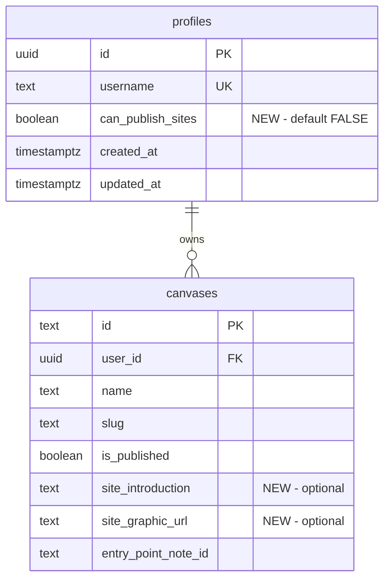

# feat: Website Hosting via /sites

## Overview

Enable select users to host websites using the canvas as the content engine. The `/sites/[username]/[page]` route already exists with basic functionality, but needs styling refinement and a gating mechanism so only approved users can publish.

This is intentionally out-of-scope from the main dyad.berlin reading app - it's a secondary feature for power users who want to use canvases as website content.

---

## Current State

### What Exists

**Routes:**
- `/sites/[username]` - Landing page listing all published canvases
- `/sites/[username]/[page]` - Individual canvas page with WebsiteContainer

**Components:**
- `WebsiteContainer.svelte` (306 lines) - Intro panel + canvas area
  - Collapsible sidebar (360px → 48px)
  - Title, author, optional introduction text with wikilinks
  - Optional header graphic
  - Cross-canvas navigation via `onPageLink`

**Database:**
- `is_published` boolean on canvases table
- RLS policies allow anyone to view published canvases
- No feature gating - any user can currently publish

**Design Brief:**
- `plans/feat-website-container.md` - Design principles from reference sites
- Key concepts: dichotomy of zones, physicality, bounded spatial viewing

### What's Missing

1. **Feature gating** - No way to restrict who can publish sites
2. **Styling refinement** - Current UI is functional but basic
3. **Introduction content** - Not being passed from canvas to WebsiteContainer
4. **Site-specific metadata** - No description, graphic URL, or custom intro text
5. **Navigation** - `siteCanvases` is loaded but not displayed in UI

---

## Proposed Solution

### Phase 1: Feature Gating (Manual)

Add a `can_publish_sites` boolean to profiles table. Default false, manually grant via Supabase dashboard.

```sql
-- supabase/migrations/XXXXXX_sites_feature_flag.sql
ALTER TABLE profiles
ADD COLUMN can_publish_sites BOOLEAN NOT NULL DEFAULT FALSE;

COMMENT ON COLUMN profiles.can_publish_sites IS
  'Feature flag: user can publish canvases as public sites';
```

**Server-side enforcement:**
- `/sites/[username]` - Only show if user has `can_publish_sites = true`
- Canvas settings - Only show "publish" option if user has flag

### Phase 2: Site Metadata

Add fields to store site-specific content:

```sql
-- Could be on canvases or a new site_settings table
ALTER TABLE canvases
ADD COLUMN site_introduction TEXT,
ADD COLUMN site_graphic_url TEXT;
```

Wire this through to WebsiteContainer:
- `introduction` → `canvas.site_introduction`
- `graphicUrl` → `canvas.site_graphic_url`

### Phase 3: Styling Refinement

The current styling is minimal. Areas to address:

1. **Landing page** (`/sites/[username]/+page.svelte`)
   - Currently: Basic list of canvas cards
   - Desired: More magazine/portfolio feel per design brief

2. **WebsiteContainer intro panel**
   - Currently: Basic sidebar with placeholder graphic
   - Desired: More refined typography, spacing, graphic treatment

3. **Canvas iframe sizing**
   - Currently: Full viewport minus sidebar
   - Consider: Bounded canvas area to match "bounded totality" principle

**Approach:** Start with the existing structure, iterate on styling through browser inspection. This is ad-hoc design work - no spec to follow.

---

## Implementation Plan

### Files to Create/Modify

| File | Change |
|------|--------|
| `supabase/migrations/XXXXXX_sites_feature_flag.sql` | Add `can_publish_sites` column |
| `src/routes/sites/[username]/+page.server.ts` | Check user has flag before showing site |
| `src/routes/canvas/[canvasId]/+page.svelte` | Hide publish option if user lacks flag |
| `src/routes/canvas/[canvasId]/+page.server.ts` | Load `can_publish_sites` from profile |
| `src/lib/components/WebsiteContainer.svelte` | Styling refinements |
| `src/routes/sites/[username]/+page.svelte` | Landing page styling |
| `src/routes/sites/[username]/[page]/+page.svelte` | Use site metadata |

### Database Changes



---

## Acceptance Criteria

### Feature Gating
- [ ] New `can_publish_sites` column on profiles table
- [ ] Users without flag cannot see publish option in canvas settings
- [ ] `/sites/[username]` returns 404 if user lacks flag
- [ ] Admin can grant access via Supabase dashboard

### Site Metadata
- [ ] Canvas can store `site_introduction` markdown text
- [ ] Canvas can store `site_graphic_url` for header image
- [ ] WebsiteContainer displays these when present

### Styling (Iterative)
- [ ] Landing page feels more polished than current list
- [ ] WebsiteContainer intro panel has refined typography
- [ ] Placeholder graphic looks intentional, not broken
- [ ] Dark/light theme both look good

---

## Questions to Resolve

1. **Where to edit site metadata?**
   - Canvas settings sidebar (existing)?
   - Separate "site settings" page?
   - Inline editing on the /sites page itself?

2. **Navigation between canvases?**
   - `siteCanvases` is loaded but not used
   - Show as sidebar nav? Footer links? Neither?

3. **What's the actual styling direction?**
   - This needs hands-on iteration in the browser
   - Start with typography and spacing tweaks
   - Reference the design brief principles

---

## References

- Design brief: `plans/feat-website-container.md`
- Current routes: `src/routes/sites/`
- WebsiteContainer: `src/lib/components/WebsiteContainer.svelte`
- RLS policies: `supabase-setup.sql:104-107`
