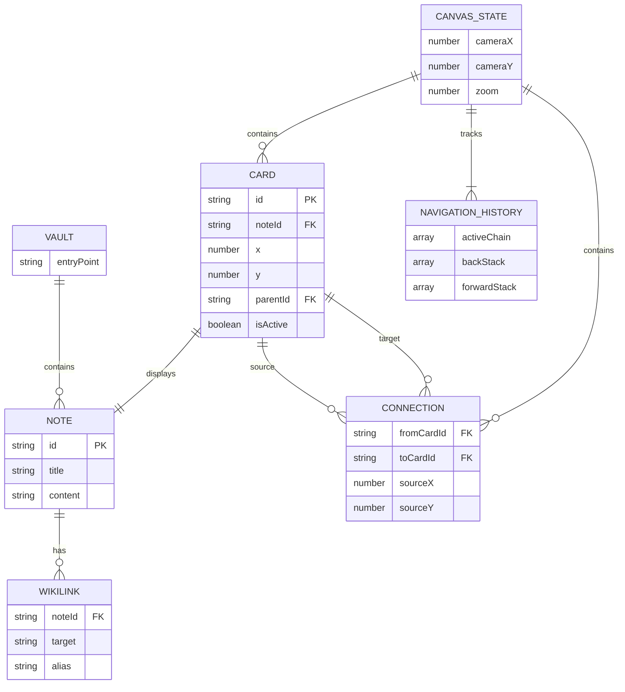

# feat: Spatial Reading Environment for Linked Markdown Notes

## Overview

A Svelte 5-based PWA that creates a spatial reading experience where markdown notes unfold onto a 2D canvas. Users click [[wikilinks]] to spawn connected note cards that expand outward, approximating non-linear thought while preserving the reading context.

**Platform**: Svelte 5 + SvelteKit PWA
**Mode**: Desktop-first, mobile compatible
**Version**: v1 (read-only)

---

## Problem Statement / Motivation

Traditional note-taking and reading interfaces force linear navigation—click a link, leave the current page, lose context. Knowledge, however, is networked. Ideas connect to other ideas in webs, not chains.

This spatial reading environment lets users:
- **See connections visually** as lines between note cards
- **Preserve context** by keeping previously opened notes visible
- **Navigate non-linearly** by branching exploration while maintaining spatial memory
- **Think in space** rather than in tabs

---

## Proposed Solution

### Core Architecture

```
┌─────────────────────────────────────────────────────────────────┐
│                        SvelteKit App                            │
├─────────────────────────────────────────────────────────────────┤
│  ┌──────────────┐  ┌──────────────┐  ┌──────────────────────┐  │
│  │   Canvas     │  │    State     │  │    Data Layer        │  │
│  │   System     │  │    Store     │  │                      │  │
│  │              │  │              │  │  ┌────────────────┐  │  │
│  │  - Pan/Zoom  │  │  - Cards[]   │  │  │ Markdown Vault │  │  │
│  │  - Viewport  │  │  - Lines[]   │  │  │ (static JSON)  │  │  │
│  │  - Culling   │  │  - NavStack  │  │  └────────────────┘  │  │
│  │              │  │  - Camera    │  │                      │  │
│  └──────────────┘  └──────────────┘  └──────────────────────┘  │
├─────────────────────────────────────────────────────────────────┤
│                      Service Worker (PWA)                       │
│                  Cache-first for offline reading                │
└─────────────────────────────────────────────────────────────────┘
```

### Technology Stack

| Layer | Technology | Rationale |
|-------|------------|-----------|
| Framework | SvelteKit 2 + Svelte 5 | Runes for reactive state, SSG for PWA |
| Canvas | SVG + d3-zoom | Good performance for ~100 cards, accessible |
| Layout | Custom radial algorithm | Simple, predictable, expandable |
| Markdown | marked + custom wikilink extension | Fast, extensible, lightweight |
| PWA | vite-plugin-pwa | Seamless service worker integration |
| State | Svelte 5 runes ($state, $derived) | Built-in, no external deps |

---

## Technical Approach

### Phase 1: Foundation

**1.1 Project Setup**
- [ ] Initialize SvelteKit with TypeScript
- [ ] Configure vite-plugin-pwa for offline support
- [ ] Set up project structure

```
src/
├── lib/
│   ├── components/
│   │   ├── Canvas.svelte         # Pan/zoom container
│   │   ├── NoteCard.svelte       # Individual note card
│   │   ├── ConnectionLine.svelte # SVG line between cards
│   │   └── MarkdownContent.svelte
│   ├── stores/
│   │   └── canvas.svelte.ts      # Runes-based state
│   ├── utils/
│   │   ├── markdown.ts           # Parser with wikilinks
│   │   ├── layout.ts             # Card positioning algorithm
│   │   └── navigation.ts         # Back/forward stack
│   └── types/
│       └── index.ts
├── routes/
│   ├── +layout.svelte
│   ├── +page.svelte
│   └── [...slug]/+page.svelte    # Deep linking support
└── app.html
```

**1.2 Data Model**

```typescript
// src/lib/types/index.ts
interface Note {
  id: string;           // Unique identifier (slug from filename)
  title: string;        // Display title
  content: string;      // Raw markdown
  wikilinks: string[];  // Extracted [[link]] targets
}

interface Card {
  id: string;           // Same as note.id
  note: Note;
  position: { x: number; y: number };
  parentId: string | null;
  sourceLink: { x: number; y: number } | null;  // Link origin for line drawing
  isActive: boolean;
}

interface CanvasState {
  cards: Map<string, Card>;
  connections: Array<{ from: string; to: string; sourcePoint: Point }>;
  camera: { x: number; y: number; zoom: number };
  activeChain: string[];  // Stack of card IDs in current navigation path
  history: { back: string[][]; forward: string[][] };
}
```

**1.3 Markdown Vault Format**

```json
// static/vault/index.json
{
  "notes": {
    "home": {
      "title": "Welcome",
      "content": "# Welcome\n\nStart exploring [[concepts]] and [[examples]].",
      "wikilinks": ["concepts", "examples"]
    },
    "concepts": {
      "title": "Core Concepts",
      "content": "# Concepts\n\n[[wikilinks]] connect ideas...",
      "wikilinks": ["wikilinks"]
    }
  },
  "entryPoint": "home"
}
```

### Phase 2: Canvas System

**2.1 Pan/Zoom Implementation**

```svelte
<!-- src/lib/components/Canvas.svelte -->
<script lang="ts">
  import { onMount } from 'svelte';
  import * as d3 from 'd3-zoom';
  import * as d3Selection from 'd3-selection';
  import { canvasState } from '$lib/stores/canvas.svelte';

  let svg: SVGSVGElement;
  let transform = $state({ x: 0, y: 0, k: 1 });

  onMount(() => {
    const zoom = d3.zoom()
      .scaleExtent([0.1, 3])
      .on('zoom', (event) => {
        transform = event.transform;
        canvasState.camera = {
          x: event.transform.x,
          y: event.transform.y,
          zoom: event.transform.k
        };
      });

    d3Selection.select(svg).call(zoom);
  });
</script>

<svg bind:this={svg} class="canvas">
  <g transform="translate({transform.x}, {transform.y}) scale({transform.k})">
    {#each connections as conn}
      <ConnectionLine {conn} />
    {/each}
    {#each cards as card}
      <NoteCard {card} onLinkClick={handleLinkClick} />
    {/each}
  </g>
</svg>
```

**2.2 Card Positioning Algorithm**

```typescript
// src/lib/utils/layout.ts
const CARD_WIDTH = 320;
const CARD_HEIGHT = 240;
const SPACING = 80;

export function calculateNewCardPosition(
  parentCard: Card | null,
  existingCards: Card[],
  linkPosition: Point | null
): Point {
  if (!parentCard) {
    // Initial card at center
    return { x: 0, y: 0 };
  }

  // Direction from parent center to link position
  const direction = linkPosition
    ? normalizeVector({
        x: linkPosition.x - parentCard.position.x,
        y: linkPosition.y - parentCard.position.y
      })
    : { x: 1, y: 0 };

  // Radial placement with collision avoidance
  const baseDistance = CARD_WIDTH + SPACING;
  let distance = baseDistance;
  let angle = Math.atan2(direction.y, direction.x);
  let attempts = 0;

  while (attempts < 32) {
    const candidate = {
      x: parentCard.position.x + Math.cos(angle) * distance,
      y: parentCard.position.y + Math.sin(angle) * distance
    };

    if (!hasOverlap(candidate, existingCards)) {
      return candidate;
    }

    // Spiral outward
    angle += Math.PI / 8;
    if (attempts % 16 === 15) {
      distance += SPACING;
    }
    attempts++;
  }

  // Fallback: place below parent
  return {
    x: parentCard.position.x,
    y: parentCard.position.y + CARD_HEIGHT + SPACING
  };
}

function hasOverlap(candidate: Point, cards: Card[]): boolean {
  return cards.some(card => {
    const dx = Math.abs(candidate.x - card.position.x);
    const dy = Math.abs(candidate.y - card.position.y);
    return dx < CARD_WIDTH + SPACING / 2 && dy < CARD_HEIGHT + SPACING / 2;
  });
}
```

### Phase 3: Navigation & Interaction

**3.1 Navigation Stack**

```typescript
// src/lib/stores/canvas.svelte.ts
export function createCanvasStore() {
  let activeChain = $state<string[]>([]);
  let history = $state<{ back: string[][]; forward: string[][] }>({
    back: [],
    forward: []
  });

  function openNote(noteId: string, fromCardId: string | null) {
    // If note already open, just add to active chain
    if (cards.has(noteId)) {
      history.back.push([...activeChain]);
      history.forward = []; // Clear forward on new navigation
      activeChain = [...activeChain, noteId];
      return;
    }

    // Create new card
    const parentCard = fromCardId ? cards.get(fromCardId) : null;
    const newCard = createCard(noteId, parentCard);
    cards.set(noteId, newCard);

    history.back.push([...activeChain]);
    history.forward = [];
    activeChain = [...activeChain, noteId];
  }

  function goBack() {
    if (history.back.length === 0) return;
    history.forward.push([...activeChain]);
    activeChain = history.back.pop()!;
  }

  function goForward() {
    if (history.forward.length === 0) return;
    history.back.push([...activeChain]);
    activeChain = history.forward.pop()!;
  }

  return {
    get activeChain() { return activeChain; },
    get canGoBack() { return history.back.length > 0; },
    get canGoForward() { return history.forward.length > 0; },
    openNote,
    goBack,
    goForward
  };
}
```

**3.2 Wikilink Parser**

```typescript
// src/lib/utils/markdown.ts
import { marked } from 'marked';

const wikilinkExtension = {
  name: 'wikilink',
  level: 'inline',
  start(src: string) {
    return src.match(/\[\[/)?.index;
  },
  tokenizer(src: string) {
    const match = /^\[\[([^\]|]+)(?:\|([^\]]+))?\]\]/.exec(src);
    if (match) {
      return {
        type: 'wikilink',
        raw: match[0],
        target: match[1].trim().toLowerCase().replace(/\s+/g, '-'),
        alias: match[2]?.trim() || match[1].trim()
      };
    }
  },
  renderer(token: { target: string; alias: string }) {
    return `<button class="wikilink" data-target="${token.target}">${token.alias}</button>`;
  }
};

marked.use({ extensions: [wikilinkExtension] });

export function parseMarkdown(content: string): string {
  return marked.parse(content) as string;
}

export function extractWikilinks(content: string): string[] {
  const regex = /\[\[([^\]|]+)(?:\|[^\]]+)?\]\]/g;
  const links: string[] = [];
  let match;
  while ((match = regex.exec(content)) !== null) {
    links.push(match[1].trim().toLowerCase().replace(/\s+/g, '-'));
  }
  return [...new Set(links)];
}
```

### Phase 4: Visual Polish

**4.1 Card Component**

```svelte
<!-- src/lib/components/NoteCard.svelte -->
<script lang="ts">
  import { parseMarkdown } from '$lib/utils/markdown';

  let { card, isInActiveChain, onLinkClick } = $props();

  let html = $derived(parseMarkdown(card.note.content));

  function handleClick(e: MouseEvent) {
    const target = e.target as HTMLElement;
    if (target.classList.contains('wikilink')) {
      const noteId = target.dataset.target;
      const rect = target.getBoundingClientRect();
      onLinkClick(noteId, card.id, { x: rect.x, y: rect.y });
    }
  }
</script>

<foreignObject
  x={card.position.x}
  y={card.position.y}
  width="320"
  height="240"
  class:dimmed={!isInActiveChain}
>
  <div class="card" onclick={handleClick}>
    <header class="card-header">
      <h2>{card.note.title}</h2>
    </header>
    <div class="card-content">
      {@html html}
    </div>
  </div>
</foreignObject>

<style>
  .card {
    background: white;
    border-radius: 8px;
    box-shadow: 0 2px 8px rgba(0,0,0,0.1);
    overflow: hidden;
    height: 100%;
    display: flex;
    flex-direction: column;
  }

  .card-header {
    padding: 12px 16px;
    border-bottom: 1px solid #eee;
    background: #fafafa;
  }

  .card-content {
    padding: 16px;
    overflow-y: auto;
    flex: 1;
  }

  :global(.wikilink) {
    background: none;
    border: none;
    color: #0066cc;
    text-decoration: underline;
    cursor: pointer;
    padding: 0;
    font: inherit;
  }

  :global(.wikilink:hover) {
    color: #004499;
  }

  .dimmed {
    opacity: 0.5;
    filter: saturate(0.7);
  }
</style>
```

**4.2 Connection Lines**

```svelte
<!-- src/lib/components/ConnectionLine.svelte -->
<script lang="ts">
  let { from, to, isActive } = $props();

  // Bezier curve from source to target
  let path = $derived(() => {
    const dx = to.x - from.x;
    const dy = to.y - from.y;
    const cx = from.x + dx * 0.5;

    return `M ${from.x} ${from.y} Q ${cx} ${from.y} ${to.x} ${to.y}`;
  });
</script>

<path
  d={path}
  class="connection"
  class:active={isActive}
  stroke-width="2"
  fill="none"
/>

<style>
  .connection {
    stroke: #ccc;
    transition: stroke 0.2s;
  }

  .connection.active {
    stroke: #0066cc;
    stroke-width: 3;
  }
</style>
```

### Phase 5: PWA & Offline

**5.1 PWA Configuration**

```javascript
// vite.config.ts
import { sveltekit } from '@sveltejs/kit/vite';
import { SvelteKitPWA } from '@vite-pwa/sveltekit';

export default {
  plugins: [
    sveltekit(),
    SvelteKitPWA({
      registerType: 'autoUpdate',
      manifest: {
        name: 'Spatial Reader',
        short_name: 'SpatialRead',
        description: 'Explore connected notes in space',
        theme_color: '#ffffff',
        background_color: '#ffffff',
        display: 'standalone',
        icons: [
          { src: 'icon-192.png', sizes: '192x192', type: 'image/png' },
          { src: 'icon-512.png', sizes: '512x512', type: 'image/png' }
        ]
      },
      workbox: {
        globPatterns: ['**/*.{js,css,html,svg,png,woff2}'],
        runtimeCaching: [
          {
            urlPattern: /^\/vault\/.*/,
            handler: 'CacheFirst',
            options: {
              cacheName: 'vault-cache',
              expiration: { maxEntries: 100, maxAgeSeconds: 60 * 60 * 24 * 30 }
            }
          }
        ]
      }
    })
  ]
};
```

---

## Acceptance Criteria

### Functional Requirements

- [ ] **Initial Load**: App loads with entry note centered on canvas
- [ ] **Wikilink Navigation**: Clicking [[link]] spawns new card with connecting line
- [ ] **No Duplicates**: Clicking link to already-open note reuses existing card
- [ ] **Pan/Zoom**: Canvas supports smooth pan (drag) and zoom (wheel/pinch)
- [ ] **Active Chain**: Current navigation path highlighted, other cards dimmed
- [ ] **Back/Forward**: Keyboard shortcuts (Alt+Left/Right) navigate history
- [ ] **Card Positioning**: New cards placed without overlap, expanding outward
- [ ] **Offline Support**: PWA works offline with cached notes
- [ ] **Deep Linking**: URLs like `/note-slug` open specific notes

### Non-Functional Requirements

- [ ] **Performance**: 60fps pan/zoom with 50+ cards
- [ ] **Load Time**: < 2s initial load on 3G
- [ ] **Mobile**: Usable on 375px viewport (touch pan/zoom)
- [ ] **Accessibility**: Keyboard navigable, screen reader announces card changes

### Quality Gates

- [ ] TypeScript strict mode passes
- [ ] Lighthouse PWA score > 90
- [ ] Manual test on Chrome, Firefox, Safari
- [ ] Mobile test on iOS Safari, Android Chrome

---

## Open Questions Requiring Decision

### Critical (Blocks Implementation)

| # | Question | Options | Recommendation |
|---|----------|---------|----------------|
| 1 | **Initial note source?** | A) Hardcoded entry point<br>B) URL parameter<br>C) localStorage last viewed | A) Hardcoded `home` note with URL override support |
| 2 | **Branching behavior?** | A) Browser model (clear forward)<br>B) Preserve all branches | A) Browser model - familiar, simpler |
| 3 | **Card limit?** | A) No limit<br>B) 50 cards max<br>C) LRU eviction at 100 | B) 50 cards max with warning |
| 4 | **Broken link handling?** | A) Show error toast<br>B) Dim link, disable click<br>C) Show placeholder card | B) Dim broken links on render |

### Important (Affects UX)

| # | Question | Recommendation |
|---|----------|----------------|
| 5 | Can users close cards? | No in v1 - simplify scope |
| 6 | Session persistence? | Yes - restore canvas state from localStorage |
| 7 | Mobile layout? | Same canvas, larger touch targets, pinch-zoom |
| 8 | Dark mode? | Defer to v2 |

---

## Risk Analysis

| Risk | Probability | Impact | Mitigation |
|------|-------------|--------|------------|
| Performance degrades with many cards | Medium | High | Implement viewport culling, limit to 50 cards |
| SVG foreignObject browser issues | Low | Medium | Test early on Safari; fallback to HTML overlay |
| Touch gesture conflicts | Medium | Medium | Use established d3-zoom touch handling |
| Wikilink parser edge cases | Low | Low | Comprehensive regex tests |

---

## Success Metrics

| Metric | Target |
|--------|--------|
| Time to interactive | < 2s |
| Cards before jank | > 50 |
| Pan/zoom framerate | 60fps |
| Lighthouse PWA score | > 90 |
| Lighthouse Accessibility | > 90 |

---

## Implementation Checklist

### Sprint 1: Foundation (Core Canvas)
- [ ] Initialize SvelteKit + TypeScript project
- [ ] Set up project structure per spec
- [ ] Create vault data format and sample notes
- [ ] Implement basic Canvas.svelte with d3-zoom
- [ ] Implement NoteCard.svelte (static positioning)
- [ ] Implement markdown parser with wikilink extension

### Sprint 2: Interaction (Navigation)
- [ ] Implement card positioning algorithm
- [ ] Add ConnectionLine.svelte
- [ ] Implement navigation store (openNote, back, forward)
- [ ] Wire up wikilink click handling
- [ ] Implement duplicate card prevention
- [ ] Add keyboard shortcuts (Alt+Left/Right)

### Sprint 3: Polish (Visual & PWA)
- [ ] Implement active chain highlighting
- [ ] Add dimming for non-active cards
- [ ] Style cards, lines, canvas background
- [ ] Configure vite-plugin-pwa
- [ ] Implement deep linking routes
- [ ] Add session persistence (localStorage)

### Sprint 4: Quality (Testing & Performance)
- [ ] Add TypeScript strict mode
- [ ] Write unit tests for layout algorithm
- [ ] Write unit tests for markdown parser
- [ ] Performance test with 100 cards
- [ ] Cross-browser testing
- [ ] Mobile device testing
- [ ] Accessibility audit

---

## ERD: Data Model



---

## References

### Internal References
- Project directory: `/home/digit/dyad.berlin` (empty, greenfield)

### External References
- [Svelte 5 Runes Documentation](https://svelte.dev/docs/svelte)
- [SvelteKit Documentation](https://svelte.dev/docs/kit)
- [d3-zoom API](https://d3js.org/d3-zoom)
- [marked.js Documentation](https://marked.js.org/)
- [vite-plugin-pwa for SvelteKit](https://vite-pwa-org.netlify.app/frameworks/sveltekit.html)
- [React Flow](https://svelteflow.dev/) - Reference architecture (Svelte port available)
- [tldraw](https://tldraw.dev/) - Reference for canvas interaction patterns

### Similar Projects
- [Obsidian Canvas](https://help.obsidian.md/plugins/canvas)
- [Scrintal](https://scrintal.com/)
- [Kosmik](https://kosmik.app/)

---

*Generated: 2026-01-12*
*Plan version: 1.0*
