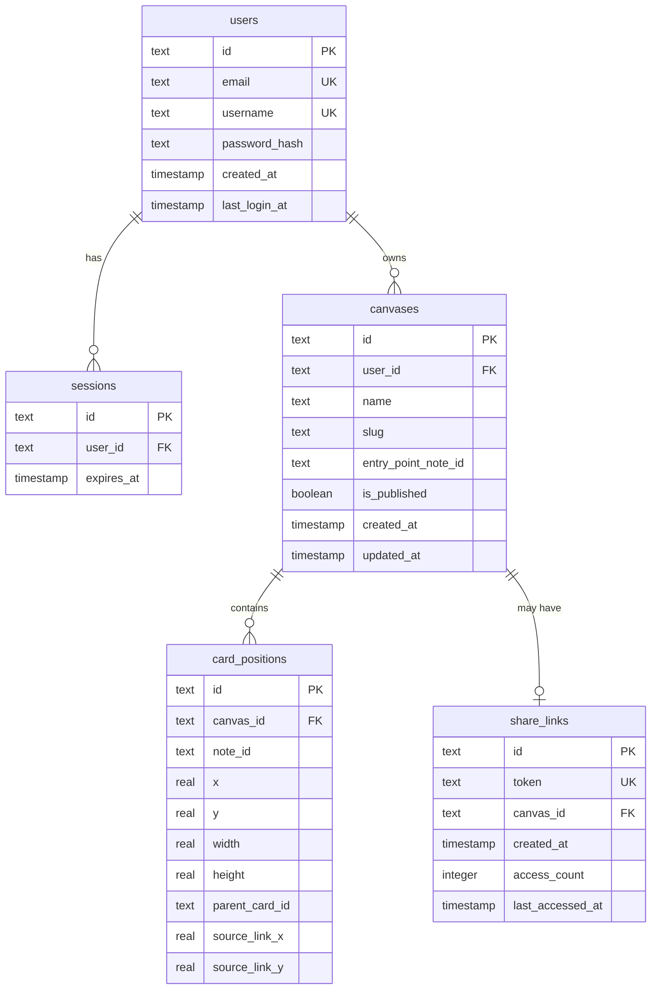

# Feature Plan: User Management, Canvas System & Publishing

**Date**: 2026-01-15
**Branch**: `feat/user-management-canvas-publishing`
**Type**: Enhancement (Major)

---

## Overview

Transform dyad.berlin from a single-user, file-based spatial reader into a multi-user platform with:
1. **User authentication** (register, login, sessions)
2. **Canvas management** (multiple canvases per user, each with its own view)
3. **Orphan cards** (cards with no parent, independent entry points)
4. **Publishing** (read-only public views with shareable URLs)

---

## Architecture Decisions

### Decision 1: Canvas as "View" (not Container)

A **canvas** is a view configuration on a shared note pool, not a separate container:
- All notes belong to a user in `/content/notes/{userId}/`
- Canvas defines: entry point, name, published status
- Same note can appear in multiple canvases
- Card positions are canvas-specific (stored per-canvas)

**Rationale**: Less data duplication, more flexible, aligns with current vault structure.

### Decision 2: Hybrid Storage

- **Database (SQLite + Drizzle)**: Users, sessions, canvases, card positions, share links
- **Markdown files**: Notes remain as `.md` files in `/content/notes/{userId}/`
- **Vault build**: Per-user vault generation at `static/vault/{userId}/index.json`

**Rationale**: Preserves markdown-centric philosophy while enabling multi-user.

### Decision 3: Simple Session-Based Auth

- Cookie-based sessions (httpOnly, secure, sameSite: strict)
- Email + password (argon2 hash)
- No email verification in v1 (simplifies MVP)
- Password reset via email link (requires SMTP)

### Decision 4: Binary Publish Model

Canvases are either:
- **Private**: Only owner can view/edit
- **Published**: Anyone with link can view (read-only)

No granular sharing (collaborators) in v1.

---

## Data Models

### Database Schema (`src/lib/server/db/schema.ts`)

```typescript
// Users table
export const users = sqliteTable('users', {
  id: text('id').primaryKey(), // nanoid
  email: text('email').notNull().unique(),
  username: text('username').notNull().unique(), // for public URLs
  passwordHash: text('password_hash').notNull(),
  createdAt: integer('created_at', { mode: 'timestamp' }).notNull(),
  lastLoginAt: integer('last_login_at', { mode: 'timestamp' })
});

// Sessions table
export const sessions = sqliteTable('sessions', {
  id: text('id').primaryKey(),
  userId: text('user_id').notNull().references(() => users.id, { onDelete: 'cascade' }),
  expiresAt: integer('expires_at', { mode: 'timestamp' }).notNull()
});

// Canvases table
export const canvases = sqliteTable('canvases', {
  id: text('id').primaryKey(), // nanoid
  userId: text('user_id').notNull().references(() => users.id, { onDelete: 'cascade' }),
  name: text('name').notNull(),
  slug: text('slug').notNull(), // URL-safe identifier
  entryPointNoteId: text('entry_point_note_id'), // nullable for empty canvas
  isPublished: integer('is_published', { mode: 'boolean' }).notNull().default(false),
  createdAt: integer('created_at', { mode: 'timestamp' }).notNull(),
  updatedAt: integer('updated_at', { mode: 'timestamp' }).notNull()
}, (table) => ({
  userSlug: unique().on(table.userId, table.slug)
}));

// Card positions (per-canvas state)
export const cardPositions = sqliteTable('card_positions', {
  id: text('id').primaryKey(),
  canvasId: text('canvas_id').notNull().references(() => canvases.id, { onDelete: 'cascade' }),
  noteId: text('note_id').notNull(), // slug of the note
  x: real('x').notNull(),
  y: real('y').notNull(),
  width: real('width').notNull(),
  height: real('height').notNull(),
  parentCardId: text('parent_card_id'), // null for orphans/entry point
  sourceLinkX: real('source_link_x'),
  sourceLinkY: real('source_link_y')
});

// Share links (capability URLs)
export const shareLinks = sqliteTable('share_links', {
  id: text('id').primaryKey(),
  token: text('token').notNull().unique(), // nanoid for URL
  canvasId: text('canvas_id').notNull().references(() => canvases.id, { onDelete: 'cascade' }),
  createdAt: integer('created_at', { mode: 'timestamp' }).notNull(),
  accessCount: integer('access_count').notNull().default(0),
  lastAccessedAt: integer('last_accessed_at', { mode: 'timestamp' })
});
```

### Note Model (unchanged, per-user directory)

```typescript
// File: /content/notes/{userId}/{noteId}.md
// Structure: YAML frontmatter + markdown content
interface Note {
  id: string;        // filename slug
  title: string;     // from frontmatter or H1
  content: string;   // markdown body
  wikilinks: string[]; // extracted [[links]]
}
```

---

## URL Structure

| Route | Purpose | Auth Required |
|-------|---------|---------------|
| `/` | Landing page / marketing | No |
| `/login` | Login form | No |
| `/register` | Registration form | No |
| `/dashboard` | User's canvas list | Yes |
| `/canvas/[canvasId]` | Private canvas view | Yes (owner) |
| `/[username]/[canvasSlug]` | Published canvas view | No |
| `/api/auth/*` | Auth endpoints | Varies |
| `/api/canvases/*` | Canvas CRUD | Yes |
| `/api/notes/*` | Note CRUD | Yes |

---

## Implementation Phases

### Phase 1: Foundation & Auth

**Files to create:**

1. `src/lib/server/db/index.ts` - Database connection
2. `src/lib/server/db/schema.ts` - Drizzle schema
3. `src/lib/server/db/operations.ts` - CRUD functions
4. `src/hooks.server.ts` - Auth middleware
5. `src/app.d.ts` - Type declarations for locals
6. `src/routes/login/+page.svelte` - Login UI
7. `src/routes/login/+page.server.ts` - Login action
8. `src/routes/register/+page.svelte` - Register UI
9. `src/routes/register/+page.server.ts` - Register action
10. `src/routes/logout/+page.server.ts` - Logout action
11. `drizzle.config.ts` - Drizzle Kit config

**Dependencies to add:**
```bash
npm install drizzle-orm better-sqlite3 @node-rs/argon2 nanoid
npm install -D drizzle-kit @types/better-sqlite3
```

### Phase 2: Canvas Management

**Files to create/modify:**

1. `src/routes/dashboard/+page.svelte` - Canvas list UI
2. `src/routes/dashboard/+page.server.ts` - Load user's canvases
3. `src/routes/canvas/[canvasId]/+page.svelte` - Canvas view (refactor from root)
4. `src/routes/canvas/[canvasId]/+page.server.ts` - Load canvas data
5. `src/routes/api/canvases/+server.ts` - Create canvas
6. `src/routes/api/canvases/[id]/+server.ts` - Update/delete canvas
7. `src/lib/stores/canvas.svelte.ts` - Adapt for multi-canvas

**Key changes:**
- Move main canvas logic from `/` to `/canvas/[canvasId]`
- Load canvas-specific state from DB instead of localStorage
- Save card positions to DB on change

### Phase 3: Per-User Notes & Vault

**Files to modify:**

1. `scripts/build-vault.ts` - Generate per-user vaults
2. `src/routes/api/notes/[slug]/+server.ts` - Add user scoping
3. `src/lib/stores/canvas.svelte.ts` - Load user-specific vault

**Directory structure:**
```
content/
  notes/
    {userId}/
      note-slug.md
static/
  vault/
    {userId}/
      index.json
```

### Phase 4: Orphan Cards

**Files to modify:**

1. `src/lib/components/Canvas.svelte` - Add "Create Orphan" button
2. `src/lib/utils/layout.ts` - Orphan positioning logic
3. `src/lib/stores/canvas.svelte.ts` - `createOrphanCard()` method
4. `src/lib/components/NoteCard.svelte` - Orphan visual indicator

**Orphan placement algorithm:**
```typescript
function getOrphanPosition(existingCards: Card[]): Point {
  const ORPHAN_SPACING = 400;
  const orphans = existingCards.filter(c => c.parentId === null);
  return {
    x: orphans.length * ORPHAN_SPACING,
    y: -300 // Above the main canvas area
  };
}
```

### Phase 5: Publishing

**Files to create:**

1. `src/routes/[username]/[canvasSlug]/+page.svelte` - Public canvas view
2. `src/routes/[username]/[canvasSlug]/+page.server.ts` - Load published data
3. `src/lib/components/PublishModal.svelte` - Publish settings UI
4. `src/routes/api/canvases/[id]/publish/+server.ts` - Toggle publish

**Public view behavior:**
- Same canvas component, but `readOnly = true`
- No edit mode, no create card
- Full zoom/pan/navigation
- Track access count

---

## ERD Diagram



---

## Acceptance Criteria

### User Management

- [ ] User can register with email, username, password
- [ ] User can login with email and password
- [ ] User can logout (clears session)
- [ ] Session persists across browser restarts (cookie)
- [ ] Invalid credentials show error message
- [ ] Username validation: lowercase alphanumeric + hyphens, 3-30 chars
- [ ] Password validation: minimum 8 characters

### Canvas Management

- [ ] Authenticated user sees dashboard with their canvases
- [ ] User can create new canvas (name required)
- [ ] User can rename canvas
- [ ] User can delete canvas (with confirmation)
- [ ] User can set canvas entry point (select existing note or create new)
- [ ] Canvas state (card positions) persists to database
- [ ] Empty canvas shows "Create your first note" prompt

### Orphan Cards

- [ ] User can create orphan card (no parent) via button/hotkey
- [ ] Orphan cards appear at designated position (not overlapping)
- [ ] Orphan cards visually distinguished (dotted border? icon?)
- [ ] Orphan can be linked as child of existing card
- [ ] Multiple orphans can exist per canvas

### Publishing

- [ ] User can toggle canvas publish status
- [ ] Published canvas has public URL: `/[username]/[canvasSlug]`
- [ ] Public view is read-only (no edit, no create)
- [ ] Public view allows zoom, pan, wikilink navigation
- [ ] Unpublishing makes URL return 404
- [ ] Owner can see access count for published canvas

---

## Security Checklist

- [ ] Passwords hashed with argon2
- [ ] Sessions stored in httpOnly cookies
- [ ] CSRF protection on state-changing operations
- [ ] API endpoints check user ownership
- [ ] Rate limiting on auth endpoints
- [ ] Input validation on all user inputs
- [ ] Path traversal prevention on note slugs
- [ ] XSS prevention (markdown sanitization)

---

## Test Plan

### Unit Tests

- [ ] Password hashing and verification
- [ ] Session creation and validation
- [ ] Canvas CRUD operations
- [ ] Note CRUD with user scoping
- [ ] Orphan positioning algorithm

### Integration Tests

- [ ] Register → Login → Create Canvas → View Canvas
- [ ] Create orphan card → Position saved → Reload → Position persists
- [ ] Publish canvas → Access public URL → View works
- [ ] Unpublish → Public URL returns 404
- [ ] Multi-user isolation (user A can't see user B's canvases)

### E2E Tests (Playwright)

- [ ] Full registration flow
- [ ] Full login/logout flow
- [ ] Canvas creation and editing
- [ ] Publishing and public view

---

## Migration Strategy

1. **Seed default user**: Create "default" user for existing notes
2. **Move existing notes**: `content/notes/*.md` → `content/notes/default/*.md`
3. **Create default canvas**: Import existing localStorage state as canvas for default user
4. **Database migration**: Run Drizzle migrations on deploy

---

## References

### Internal Files
- `src/lib/stores/canvas.svelte.ts:1-200` - Current canvas state management
- `src/lib/types/index.ts:1-50` - Type definitions
- `src/routes/api/notes/[slug]/+server.ts:1-80` - Existing note API pattern
- `src/lib/utils/layout.ts:1-100` - Card positioning algorithm

### External Documentation
- [SvelteKit Auth](https://svelte.dev/docs/kit/auth)
- [Drizzle ORM SQLite](https://orm.drizzle.team/docs/get-started-sqlite)
- [Lucia v3](https://v3.lucia-auth.com/getting-started/sveltekit)
- [Argon2 Node](https://github.com/ranisalt/node-argon2)

### Best Practices Applied
- Cookie-based sessions over JWT for better security
- Capability URLs (nanoid tokens) for sharing
- Database-first with file fallback for notes
- Canvas as view (not container) for flexibility
