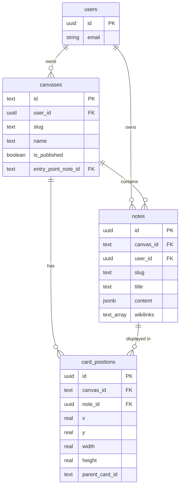

# refactor: Note Isolation Data Model

## Overview

Review and refactor the data model for notes and canvases to implement **canvas-scoped note isolation**. Currently, notes are user-scoped and can be shared across canvases. The proposed change makes notes canvas-scoped with duplicate wikilink detection.

**Key Changes:**
1. Notes belong to a single canvas, not shared across canvases
2. Same wikilink text in multiple places prompts "Create New / Link to Existing"
3. Notes remain user-owned (for auth) but canvas-isolated (for content)

## Problem Statement / Motivation

### Current Architecture

```
User
  └── Notes (user_id, slug) ← Notes shared across all user's canvases
        └── Canvas A references note "foo"
        └── Canvas B references note "foo" ← SAME note instance
```

**Current Schema** (`supabase-setup.sql:33-42`):
```sql
CREATE TABLE notes (
  user_id UUID NOT NULL REFERENCES auth.users(id),
  slug TEXT NOT NULL,
  PRIMARY KEY (user_id, slug)  -- User-scoped, NOT canvas-scoped
);
```

### Issues with Current Model

1. **Unintended content bleed**: Editing a note in Canvas A affects Canvas B
2. **No isolation between contexts**: Research canvas shares notes with personal canvas
3. **Wikilink collisions**: `[[meeting-notes]]` in two canvases forces shared context
4. **Mental model mismatch**: Users expect canvas independence

### Desired Architecture

```
User
  └── Canvas A
  │     └── Notes (canvas_id, slug) ← Isolated to Canvas A
  │           └── note "foo" (Canvas A version)
  └── Canvas B
        └── Notes (canvas_id, slug) ← Isolated to Canvas B
              └── note "foo" (Canvas B version, different content)
```

## Proposed Solution

### Data Model Changes

#### Option A: Canvas-Scoped Primary Key (Recommended)

```sql
CREATE TABLE notes (
  id UUID PRIMARY KEY DEFAULT gen_random_uuid(),
  canvas_id TEXT NOT NULL REFERENCES canvases(id) ON DELETE CASCADE,
  user_id UUID NOT NULL REFERENCES auth.users(id) ON DELETE CASCADE,
  slug TEXT NOT NULL,
  title TEXT NOT NULL,
  content JSONB NOT NULL DEFAULT '{}',
  wikilinks TEXT[] DEFAULT '{}',
  created_at TIMESTAMPTZ DEFAULT NOW(),
  updated_at TIMESTAMPTZ DEFAULT NOW(),

  UNIQUE(canvas_id, slug)  -- Slugs unique per canvas
);
```

**Rationale:**
- `id` (UUID): Stable internal reference for foreign keys
- `canvas_id`: Primary isolation boundary
- `user_id`: Retained for ownership/auth (RLS policies)
- `UNIQUE(canvas_id, slug)`: Allows same slug in different canvases

#### Card Positions Update

```sql
-- Change note_id from slug to UUID
ALTER TABLE card_positions
  ALTER COLUMN note_id TYPE UUID USING note_id::uuid;

ALTER TABLE card_positions
  ADD CONSTRAINT fk_note
  FOREIGN KEY (note_id) REFERENCES notes(id) ON DELETE CASCADE;
```

### Wikilink Resolution Changes

**Current** (`canvas.svelte.ts:162-171`):
```typescript
// Looks up slug in entire user vault
const validNoteIds = new Set(Object.keys(vault.notes));
```

**Proposed**:
```typescript
// Looks up slug in current canvas only
const validNoteIds = new Set(
  Object.values(vault.notes)
    .filter(note => note.canvasId === currentCanvasId)
    .map(note => note.slug)
);
```

### Duplicate Wikilink Detection

When user clicks a wikilink where the target note already exists on the canvas:

```typescript
// In NoteCard.svelte handleWikilinkClick()
function handleWikilinkClick(target: string) {
  const existingCard = canvasStore.findCardBySlug(target);

  if (existingCard && !canvasStore.isLinkBroken(target)) {
    // Note exists and is already on canvas - show prompt
    showDuplicateLinkPrompt({
      slug: target,
      existingCardId: existingCard.id,
      onCreateNew: () => createNoteWithNewSlug(target),
      onLinkExisting: () => focusExistingCard(existingCard.id)
    });
    return;
  }

  // Normal flow: open or create note
  onLinkClick(target, card.id, linkBounds);
}
```

**Prompt UI:**
```
┌─────────────────────────────────────────────┐
│ "meeting-notes" already exists on canvas    │
│                                             │
│ [Create New Note]  [Focus Existing]         │
└─────────────────────────────────────────────┘
```

**"Create New Note" Slug Generation:**
- Append numeric suffix: `meeting-notes-2`, `meeting-notes-3`
- Check for collisions and increment

**"Focus Existing" Behavior:**
- Pan/zoom to existing card (don't duplicate)

## Technical Approach

### Phase 1: Schema Migration

#### 1.1 Add UUID Primary Key to Notes

```sql
-- Migration: 001_add_note_uuid.sql

-- Add new UUID column
ALTER TABLE notes ADD COLUMN id UUID DEFAULT gen_random_uuid();

-- Populate existing rows
UPDATE notes SET id = gen_random_uuid() WHERE id IS NULL;

-- Make non-nullable
ALTER TABLE notes ALTER COLUMN id SET NOT NULL;
```

#### 1.2 Add Canvas Reference

```sql
-- Migration: 002_add_canvas_to_notes.sql

-- Add canvas_id column
ALTER TABLE notes ADD COLUMN canvas_id TEXT;

-- Populate from card_positions (assign note to first canvas where it appears)
UPDATE notes n
SET canvas_id = (
  SELECT cp.canvas_id
  FROM card_positions cp
  WHERE cp.note_id = n.slug
  LIMIT 1
);

-- For orphan notes (no card_positions), assign to user's first canvas
UPDATE notes n
SET canvas_id = (
  SELECT c.id FROM canvases c
  WHERE c.user_id = n.user_id
  ORDER BY c.created_at
  LIMIT 1
)
WHERE n.canvas_id IS NULL;

-- Add foreign key constraint
ALTER TABLE notes
  ADD CONSTRAINT fk_canvas
  FOREIGN KEY (canvas_id) REFERENCES canvases(id) ON DELETE CASCADE;

-- Make non-nullable
ALTER TABLE notes ALTER COLUMN canvas_id SET NOT NULL;
```

#### 1.3 Update Primary Key

```sql
-- Migration: 003_update_notes_pk.sql

-- Drop old primary key
ALTER TABLE notes DROP CONSTRAINT notes_pkey;

-- Add new primary key
ALTER TABLE notes ADD PRIMARY KEY (id);

-- Add unique constraint for canvas-scoped slugs
ALTER TABLE notes ADD CONSTRAINT unique_canvas_slug UNIQUE (canvas_id, slug);
```

#### 1.4 Update Card Positions Foreign Key

```sql
-- Migration: 004_update_card_positions_fk.sql

-- Add new note_uuid column
ALTER TABLE card_positions ADD COLUMN note_uuid UUID;

-- Populate from notes table (using canvas context)
UPDATE card_positions cp
SET note_uuid = (
  SELECT n.id FROM notes n
  WHERE n.slug = cp.note_id
  AND n.canvas_id = cp.canvas_id
);

-- Handle any orphans (create notes for them)
-- [Complex migration logic here]

-- Drop old column, rename new
ALTER TABLE card_positions DROP COLUMN note_id;
ALTER TABLE card_positions RENAME COLUMN note_uuid TO note_id;

-- Add foreign key
ALTER TABLE card_positions
  ADD CONSTRAINT fk_note
  FOREIGN KEY (note_id) REFERENCES notes(id) ON DELETE CASCADE;
```

#### 1.5 Update RLS Policies

```sql
-- Migration: 005_update_rls_policies.sql

-- Drop old policies
DROP POLICY IF EXISTS "Users can view their own notes" ON notes;
DROP POLICY IF EXISTS "Users can insert their own notes" ON notes;
DROP POLICY IF EXISTS "Users can update their own notes" ON notes;
DROP POLICY IF EXISTS "Users can delete their own notes" ON notes;

-- New policies with canvas context
CREATE POLICY "notes_select" ON notes FOR SELECT
TO authenticated
USING (
  (SELECT auth.uid()) = user_id
  OR EXISTS (
    SELECT 1 FROM canvases c
    WHERE c.id = notes.canvas_id
    AND c.is_published = TRUE
  )
);

CREATE POLICY "notes_insert" ON notes FOR INSERT
TO authenticated
WITH CHECK ((SELECT auth.uid()) = user_id);

CREATE POLICY "notes_update" ON notes FOR UPDATE
TO authenticated
USING ((SELECT auth.uid()) = user_id);

CREATE POLICY "notes_delete" ON notes FOR DELETE
TO authenticated
USING ((SELECT auth.uid()) = user_id);
```

### Phase 2: Type System Updates

#### 2.1 Update TypeScript Types

```typescript
// src/lib/types/index.ts

export interface Note {
  id: string;           // UUID (new)
  canvasId: string;     // Canvas scope (new)
  slug: string;         // Human-readable identifier
  title: string;
  content: JSONContent;
  wikilinks: string[];  // Still slugs (canvas-local resolution)
}

export interface Vault {
  notes: Record<string, Note>;  // Keyed by UUID now, not slug
  entryPoint: string;           // UUID of entry note
}

// Helper for slug-based lookups within canvas
export function findNoteBySlug(vault: Vault, canvasId: string, slug: string): Note | undefined {
  return Object.values(vault.notes).find(
    note => note.canvasId === canvasId && note.slug === slug
  );
}
```

### Phase 3: API Updates

#### 3.1 Notes CRUD Endpoints

```typescript
// src/routes/api/canvases/[canvasId]/notes/+server.ts (NEW)

// GET - List notes for canvas
export async function GET({ params, locals }) {
  const { canvasId } = params;
  const { data, error } = await locals.supabase
    .from('notes')
    .select('*')
    .eq('canvas_id', canvasId);
  // ...
}

// POST - Create note in canvas
export async function POST({ params, request, locals }) {
  const { canvasId } = params;
  const { slug, title, content } = await request.json();
  // ...
}
```

```typescript
// src/routes/api/canvases/[canvasId]/notes/[slug]/+server.ts (NEW)

// GET - Get specific note by slug within canvas
export async function GET({ params, locals }) {
  const { canvasId, slug } = params;
  const { data, error } = await locals.supabase
    .from('notes')
    .select('*')
    .eq('canvas_id', canvasId)
    .eq('slug', slug)
    .single();
  // ...
}

// PUT - Update note
// DELETE - Delete note
```

### Phase 4: Store Updates

#### 4.1 Canvas Store Changes

```typescript
// src/lib/stores/canvas.svelte.ts

class CanvasStore {
  // Add canvas context
  private currentCanvasId = $state<string | null>(null);

  // Notes now keyed by UUID
  private notesByUuid = $state<Map<string, Note>>(new Map());

  // Index for slug lookups within canvas
  private notesBySlug = $derived<Map<string, Note>>(() => {
    const map = new Map();
    for (const note of this.notesByUuid.values()) {
      if (note.canvasId === this.currentCanvasId) {
        map.set(note.slug, note);
      }
    }
    return map;
  });

  // Updated broken link check
  isLinkBroken(slug: string): boolean {
    return !this.notesBySlug.has(slug);
  }

  // Find card by slug (for duplicate detection)
  findCardBySlug(slug: string): Card | undefined {
    for (const card of this.cards.values()) {
      if (card.note.slug === slug) {
        return card;
      }
    }
    return undefined;
  }
}
```

### Phase 5: Duplicate Link Prompt

#### 5.1 Create Prompt Component

```svelte
<!-- src/lib/components/DuplicateLinkPrompt.svelte -->
<script lang="ts">
  interface Props {
    slug: string;
    position: { x: number; y: number };
    onCreateNew: () => void;
    onFocusExisting: () => void;
    onClose: () => void;
  }

  let { slug, position, onCreateNew, onFocusExisting, onClose }: Props = $props();
</script>

<div
  class="duplicate-prompt"
  style="left: {position.x}px; top: {position.y}px"
>
  <p>"{slug}" already exists on this canvas</p>
  <div class="actions">
    <button onclick={onCreateNew}>Create New Note</button>
    <button onclick={onFocusExisting}>Focus Existing</button>
  </div>
</div>
```

#### 5.2 Slug Generation for "Create New"

```typescript
// src/lib/utils/slug.ts

export function generateUniqueSlug(
  baseSlug: string,
  existingSlugs: Set<string>
): string {
  if (!existingSlugs.has(baseSlug)) {
    return baseSlug;
  }

  let counter = 2;
  while (existingSlugs.has(`${baseSlug}-${counter}`)) {
    counter++;
  }
  return `${baseSlug}-${counter}`;
}
```

## Acceptance Criteria

### Functional Requirements

- [ ] Notes are scoped to a single canvas
- [ ] Same slug can exist in different canvases (different content)
- [ ] Wikilinks resolve within current canvas only
- [ ] Clicking wikilink to existing canvas note shows prompt
- [ ] "Create New Note" generates unique slug with suffix
- [ ] "Focus Existing" pans to existing card
- [ ] Published canvases show canvas-scoped notes
- [ ] Existing data migrated correctly

### Non-Functional Requirements

- [ ] Migration completes without data loss
- [ ] RLS policies enforce canvas isolation
- [ ] API endpoints require canvas context
- [ ] Performance: Note lookup O(1) within canvas

### Quality Gates

- [ ] All existing tests pass after migration
- [ ] New tests for canvas-scoped operations
- [ ] Migration tested on copy of production data
- [ ] Rollback procedure documented and tested

## Migration Strategy

### Pre-Migration

1. **Backup production database**
2. **Run migration on staging** with production data copy
3. **Verify data integrity**: Count notes before/after
4. **Test rollback procedure**

### Migration Steps

1. Run schema migrations (001-005)
2. Verify foreign key integrity
3. Update API endpoints
4. Deploy frontend changes
5. Clear localStorage (force fresh state)

### Rollback Plan

```sql
-- Rollback script (if needed)
-- Restore from backup or:
ALTER TABLE notes DROP CONSTRAINT unique_canvas_slug;
ALTER TABLE notes DROP COLUMN canvas_id;
ALTER TABLE notes ADD PRIMARY KEY (user_id, slug);
-- ... reverse all migrations
```

### Data Integrity Checks

```sql
-- Verify no orphaned notes
SELECT COUNT(*) FROM notes WHERE canvas_id IS NULL;

-- Verify no orphaned card_positions
SELECT COUNT(*) FROM card_positions cp
LEFT JOIN notes n ON cp.note_id = n.id
WHERE n.id IS NULL;

-- Verify unique constraint holds
SELECT canvas_id, slug, COUNT(*)
FROM notes
GROUP BY canvas_id, slug
HAVING COUNT(*) > 1;
```

## Risk Analysis

| Risk | Likelihood | Impact | Mitigation |
|------|------------|--------|------------|
| Data loss during migration | Medium | High | Full backup, tested rollback |
| Broken wikilinks after migration | High | Medium | Migration assigns notes to correct canvas via card_positions |
| User confusion about isolation | Medium | Medium | In-app messaging, documentation |
| Performance regression | Low | Medium | Index on (canvas_id, slug) |
| Published canvas breaks | Medium | High | Test RLS policies thoroughly |

## Open Questions

### Clarified (Assumptions Made)

1. **Primary key structure**: Using `(id UUID)` with `UNIQUE(canvas_id, slug)` - combines stability of UUID with slug uniqueness
2. **Note ID in code**: Using UUID for internal references, slug for wikilinks
3. **Prompt trigger**: Only when note already has visible card on canvas
4. **"Create New" slug**: Append numeric suffix (`-2`, `-3`)
5. **"Focus Existing"**: Pan to card, don't duplicate

### Still Open

1. **Cross-canvas linking**: Should we support `[[canvas-b:slug]]` syntax? (Assumption: No, not in v1)
2. **Note copying**: Should there be a "Copy to Canvas" feature? (Assumption: Manual copy-paste only)
3. **Dashboard view**: How to show notes grouped by canvas? (Assumption: Canvas filter dropdown)

## Files to Modify

### Database
- `supabase-setup.sql` - Schema changes
- New migration files (001-005)

### Types
- `src/lib/types/index.ts:8-13` - Note interface
- `src/lib/types/index.ts:76-79` - Vault interface

### API
- `src/routes/api/notes/+server.ts` - Deprecate or redirect
- `src/routes/api/notes/[slug]/+server.ts` - Deprecate or redirect
- NEW: `src/routes/api/canvases/[canvasId]/notes/+server.ts`
- NEW: `src/routes/api/canvases/[canvasId]/notes/[slug]/+server.ts`

### Store
- `src/lib/stores/canvas.svelte.ts:162-171` - Broken link detection
- `src/lib/stores/canvas.svelte.ts:400-450` - Note loading
- `src/lib/stores/canvas.svelte.ts:500-600` - openNote() method

### Components
- `src/lib/components/NoteCard.svelte:93-126` - Wikilink click handling
- NEW: `src/lib/components/DuplicateLinkPrompt.svelte`

### Utils
- `src/lib/utils/slug.ts` - Add generateUniqueSlug()

## ERD Diagram



## References

### Internal
- Current schema: `supabase-setup.sql:33-42`
- Note types: `src/lib/types/index.ts:8-13`
- Canvas store: `src/lib/stores/canvas.svelte.ts`
- Wikilink handling: `src/lib/components/NoteCard.svelte:93-126`

### External
- [Supabase RLS Documentation](https://supabase.com/docs/guides/database/postgres/row-level-security)
- [Obsidian Vault Isolation Model](https://forum.obsidian.md/t/one-vault-vs-multiple-vaults/1445)
- [Notion Data Model](https://www.notion.com/blog/data-model-behind-notion)
